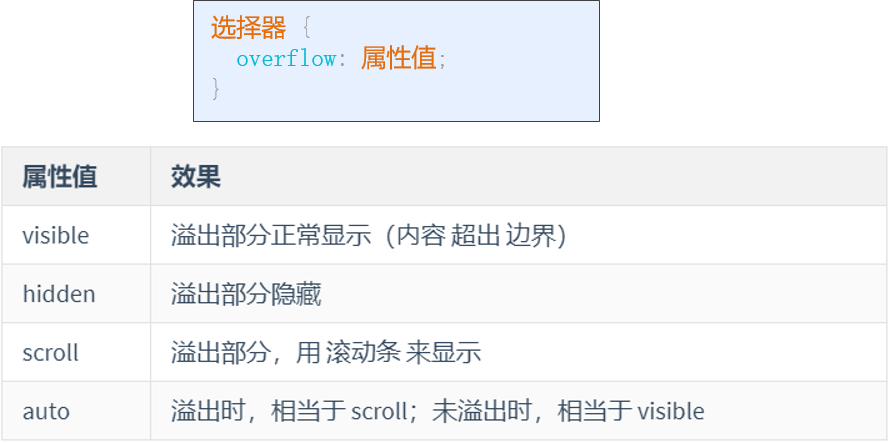

# 第二章：CSS 样式

> **引言：**
>
> CSS 以 HTML 为基础，提供了丰富的功能，如：字体、颜色、背景的控制及整体的排版等，而且还可以针对不同的浏览器设置不同的样式

## 第一节：CSS3 入门

### 主流浏览器的私有属性

| 内核类型 |  相关浏览器的私有属性  | 私有前缀 |
| :------: | :--------------------: | :------: |
| Trident  |    IE8 / IE9 / IE10    |   -ms    |
|  Webkit  | 谷歌（Chrome）/ Safari | -webkit  |
|  Gecko   |    火狐（Firefox）     |   -moz   |
|  Blink   |         Opera          |    -o    |

> **注意：**
>
> - 运用 CSS 私有属性时，要遵从一定的书写顺序，即先写私有的 CSS3 属性，在写标准的 CSS3 属性
>
> - 当 CSS3 属性成为标准属性，并被主流浏览器的最新版兼容时，就可以省略私有的 CSS3 属性


---


## 第二节：CSS3 核心基础

### 2.2.1 CSS 样式规则

```html
选择器{属性1:属性值1; 属性2:属性值2; 属性3:属性值3;}
```

**注意：**

- CSS 样式中的选择器严格区分大小写，属性和值不区分大小写，按照书写习惯一般将 "选择器、属性和值" 都采用小写的方式

- 多个属性之间必须用英文状态下的分号隔开，最后一个 属性后的分号可以省略，但是为了便于增加新样式最好保留

- 如果属性的值由多个单词组成且中间包含空格，则必须为这个属性值加上英文状态下的引号

  - ```html
    p {font-famliy: "Times New Roman"; }
    ```

- 在编写代码时，为了提高代码的可读性，通常会加上 CSS 注释

  - ```css
    /* 这是注释，不会在浏览器页面显示 */
    ```

- 在 CSS 代码中，空格是不被解析的，花括号及分号前后的空格可有可无，可以利用空格、Tab键 来对代码进行格式化，提高可读性

  - ```html
    p {
        /* 定义字体大小 */
        font-size: 24px;
        /* 定义字体颜色 */
        color: red;
    }
    ```
    
    

### 2.2.2 引入 CSS 样式表

#### 标记样式的 3种 引用方式

1. **行内式**

   > 样式写在HTML标签里，利用style属性引入

   ```html
   语法格式：
   <标记名 style="属性1:属性值1; 属性2:属性值2; 属性3:属性值3;"> 内容 </标记名>
   
   
   <h2 style="font-size: 36px; color: red;"> </h2>
   ```

2. **内联式**

   >style 标签用于为 HTML 文档定义样式信息，位于 head 头部标记中，并用 style 标记定义

   ```html
   语法格式：
   <style 属性="属性值">
   	选择器 {
           属性1:属性值1;
           属性2:属性值2;
           属性3:属性值3;
       }
   </style>
   
   
   <style type="text/css">
       h2{color:red;}
   </style>
   ```

3. **链入式**

   > 链入式是将所有的样式放在一个或多个以 .css 为扩展名的外部样式表文件中，通过 link 标记将外部样式表文件链接到 HTML 文档中

```html
语法格式：
<link href="css文件路径" type="text/css" rel="stylesheet" 属性="属性值" />


<link rel="stylesheet" type="text/css" href="style.css" />
<link rel="stylesheet" type="text/javascript" href="style.js" />
```

| 属性名 |   常用属性值    |                             描述                             |
| :----: | :-------------: | :----------------------------------------------------------: |
|  href  |       URL       |                    指定引用外部文档的地址                    |
|  rel   |   stylesheet    | 指定当前文档与引用外部文档的关系，该属性值通常为stylesheet，表示定义一个外部样式表 |
|  type  |    text/css     |                引用外部文档的类型为CSS样式表                 |
|  type  | text/javascript |              引用外部文档的类型为JavaScript脚本              |

> **解释：**
>
> - href：定义所有链接外部样式表文件的 URL，相对路径、绝对路径 都可
> - type：定义所链接文档的类型，在这里需要指定为 "text/css"，表示链接的外部文件为 CSS 样式表
> - rel：定义当前文档与被链接文档之间的关系，在这里需要指定为 "stylesheet"，表示被链接的文档是一个样式表文件


### 2.2.3 更改网站标题栏图标

~~~html
<link rel="SHORICUI ICON" href="图标地址">		<!-- 一般采用 icon 格式图片文件 -->
~~~


### 2.2.4 CSS 基础选择器

> 要想将 CSS 样式应用于特定的 HTML 元素，首先要找到该目标元素
>
> 在 CSS 中，执行这一任务的样式规则部分被称为选择器
>
> CSS 基础选择器有：标记选择器、类选择器、id 选择器、通配符选择器、标签指定式选择器、后代选择器 和 并集选择器

#### 标记选择器

> 标记选择器是指用 HTML 标记名称作为选择器，按标记名称分类，为页面中某一类标记制定统一的 CSS 样式
>
> **优缺点：**
>
> - **标记选择器最大的优点是能快速为页面中同类型的标记统一样式，同时也是最大的缺点，不能设计差异化样式**

```css
语法格式：
标记名 {属性1:属性值1; 属性2:属性值2; 属性3:属性值3; }


h2 {font-size: 36px; color: red; }
```


#### 通配符选择器

> 通配符选择器用 "*" 号标识，它是所有选择器中作用范围最广的，能匹配页面中所有的元素
>
> **优缺点：**
>
> - **实际开发中不建议使用通配符选择器，因为它设置的样式对所有 HTML 标记都生效，不管是否需要该样式，这样反而降低了代码的执行速度**

```css
* {
    /* 清空外边距 */
    margin: 0;
    /* 清空内边距 */
    padding: 0;
}
```


#### 类选择器

> 类选择器使用 "." 进行标识，后面紧跟类名
>
> **类名即为 HTML 元素的 class 属性值**，大多数 HTML 元素都可以定义 class 属性
>
> - **类名第一个字符不能使用数字，并且严格区分大小写，一般采用小写的英文字符**
>
> **优缺点：**
>
> - **类选择器最大的优势是可以为元素对象定义 单独或相同的样式**

```html
语法格式：
.类名 {属性1:属性值1; 属性2:属性值2; 属性3:属性值3; }


<head>
    <style type="text/css">
        .title {
            font-size: 36px;
        }
    </style>
</head>
<body>
    <h3 class="title"> 标题 </h3>
</body>
```


#### id 选择器

>id 选择器使用 "#" 进行标识，后面 紧跟 id名
>
>**id 名 即为 HTML 元素的 id 属性值**，大多数 HTML 元素都可以定义 id 属性
>
>**优缺点：**
>
>- **元素的 id 值 是为的，只能对应于文档中某一个具体的元素**

```html
语法格式：
#id名 {属性1:属性值1; 属性2:属性值2; 属性3:属性值3; }


<head>
    <style type="text/css">
        #title {
            font-size: 36px;
        }
    </style>
</head>
<body>
    <h3 id="title"> 标题 </h3>
</body>
```


#### 后代选择器

> 后代选择器用来选择元素或元素组的后代，其写法就是把外层标记写在前面，内层标记写在后面，中间用空格分隔
>
> 当标记发生嵌套时，内层标记就成为了外层标记的后代
>
> 后代选择器不限于使用两个元素，可以一直嵌套标记，只需要加上空格即可

```html
<head>
    <style type="text/css">
        p strong {
            color: red;
        }
    </style>
</head>
<body>
    <p>这是一段话 <strong> 嵌入了一些文字 </strong> </p>
    <strong> 对此段文字没有影响 </strong>
</body>
```


#### 并集选择器

> 并集选择器是各个选择器通过逗号连接而成的，任何形式的选择器，都可以作为并集选择器的一部分
>
> 如果某些选择器定义的样式完全相同或部分相同，就可以利用并集选择器为它们定义相同的 CSS 样式

```html
<head>
    <style type="text/css">
        p, .txt, #titie {
            color: red;
        }
    </style>
</head>
<body>
    <h3 id="title"> 标题 </h3>
    <p> 这是一段话 </p>
    <strong class="txt"> 乱入的一些文字 </strong>
</body>
```


#### 交集选择器

> 交集选择器又两个选择器构成，其中第一个为标签选择器，第二个为class选择器，两个选择器之间不能有空格，**使标签定位更加精准**

~~~css
语法格式：
标记名.类名 {属性1:属性值1; 属性2:属性值2; 属性3:属性值3; }
标记名#id名 {属性1:属性值1; 属性2:属性值2; 属性3:属性值3; }

<head>
    <style type="text/css">
		h3.title {
            font-size: 42px;
        }
    </style>
</head>
<body>
    <h3> 普通标题 </h3>
    <h3 class="title"> 类标题 </h3>
</body>
~~~


#### 复合选择器（标签指定式）

> 标签指定式选择器又称交集选择器，由两个选择器构成，其中第一个为标记选择器，第二个为 class 选择器 或 id 选择器，两个选择器之间不能有空格

```html
语法格式：
标记名 标记名.类名 {属性1:属性值1; 属性2:属性值2; 属性3:属性值3; }
标记名 标记名#id名 {属性1:属性值1; 属性2:属性值2; 属性3:属性值3; }


<head>
    <style type="text/css">
		div h3.title {
            font-size: 42px;
        }
    </style>
</head>
<body>
    <div>
        <h3> 普通标题 </h3>
    	<h3 class="title"> 类标题 </h3>
    </div>
</body>
```


### 2.2.5 文本样式属性

**lorem: 自动生成一段英文**

~~~html
lorem
~~~


#### 字体样式属性

1. **font-size: 字体大小**

   > 设置字体字号，可以使用相对长度单位，也可以使用绝对长度单位
   >
   > **相对长度单位比较常用，推荐使用像素单位 px**，绝对长度单位使用较少

   | 相对长度单位 |              说明              |
   | :----------: | :----------------------------: |
   |      em      | 相对于当前对象内文本的字体尺寸 |
   |      px      |     像素，最常用，推荐使用     |

   | 绝对长度单位 | 说明 |
   | :----------: | :--: |
   |      in      | 英寸 |
   |      cm      | 厘米 |
   |      mm      | 毫米 |
   |      pt      |  点  |

   ```css
   p { font-size: 24px;}
   ```

   

2. **font-family: 字体**

   > 设置字体，常用的字体有：宋体、微软雅黑、黑体（实际开发使用时注意字体版权问题）
   >
   > **注意：**
   >
   > - 各种字体之间必须使用英文状态下的用逗号隔开
   > - 中文字体需要加英文状态下的引号，英文字体一般不需要加引号，当设置英文字体时，英文字体名必须位于中文字体名之前
   > - 如果字体中包含空格、#、$ 等符号，则该字体必须加上英文状态下的单引号或双引号
   > - 尽量使用系统默认字体，保证在任何用户的浏览器中都能正确显示

   ````css
   p {font-family: "思源宋体";}
   
   
   可以设置多个字体，中间用逗号隔开，当浏览器不支持第一个字体时，则会尝试下一个，直到找到合适的字体
   p {font-family: "思源宋体", "微软雅黑", "黑体";}
   ````

   

3. **font-weight: 字体粗细**

   > **实际开发中，常用的属性值为 normal 和 bold，用来定义正常或加粗显示的字体** 

   |       可用属性值       |                             描述                             |
   | :--------------------: | :----------------------------------------------------------: |
   |         normal         |                    默认值。定义标准的字符                    |
   |          bold          |                         定义粗体字符                         |
   |         bolder         |                        定义更粗的字符                        |
   |        lighter         |                        定义更细的字符                        |
   | 100~900（100的整数倍） | 定义由细到粗的字符，其中 400 等同于 normal，700 等同于 bold，值越大字体越粗 |

   

4. **font-style: 字体风格**

   > 定义字体风格，如：斜体、倾斜或正常字体
   >
   > **其中 italic 和 oblique 都用于定义斜体，两者在显示效果上并没有本质区别，实际开发中常使用 italic** 

   | 可用属性值 |                描述                |
   | :--------: | :--------------------------------: |
   |   normal   | 默认值，浏览器会显示标准的字体样式 |
   |   italic   |     浏览器会显示斜体的字体样式     |
   |  oblique   |     浏览器会显示倾斜的字体样式     |

   

5. **font: 综合设置字体样式**

   >使用综合设置时，必须按照顺序进行书写，各个属性之间以空格隔开
   >
   >**不需要的属性可以省略（取默认值），但必须保留 font-size 和 font-family 属性，否则 font 属性将不起作用** 
   >
   >**font-family 必须放在最后一个属性的位置才可以实现 ** 

   ```css
   语法格式：
   选择器 {font: font-style font-weight font-size / line-height font-family;}
   			  字体风格		字体粗细	字体大小  /		行高		  字体
   
   省略
   选择器 {italic 18px / 30px "宋体";}
   ```

   

6. **@font-face 属性**

   > CSS3 新增属性，用于定义服务器字体，开发者可以在用户计算机未安装字体时，使用任何喜欢的字体
   >
   > **使用步骤：**
   >
   > 1. 下载字体，并存储到相应的文件夹中
   > 2. 使用 @font-face 属性定义服务器字体
   > 3. 对元素应用 "font-family" 字体样式

   ```css
   语法格式：
   @font-face {
       font-family: "字体名称";
       src: 字体文件路径;
   }
   
   
   @font-face {
       font-family: "隶书";
       src: url(font/FZJZJW.TTF);
   }
   ```

   

7. **word-wrap 属性**

   >实现长单词和 URL 地址的自动换行
   >
   >**在相同的宽度高度的盒子内，浏览器默认处理时 URL 地址会溢出边框，属性为 break-word 时，URL 地址会沿边框自动换行**

   | 可用属性值 |                    描述                    |
   | :--------: | :----------------------------------------: |
   |   normal   | 只在允许的断字点换行（浏览器保持默认处理） |
   | break-word |      在长单词或 URL 地址内部进行换行       |

   ```html
   <head>
       <style type="text/css">
           .title {
               word-wrap: break-word;
           }
       </style>
   </head>
   <body>
       <p> 这是一个网址http://www.baidu.com </p>
       <p class="title"> 这是一个网址http://www.baidu.com </p>
   </body>
   
   
   <!-- 效果展示： -->
   <!-- normal 效果 -->
   这是一个网址
   http://www.baidu.com
   
   <!-- break-word 效果 -->
   这是一个网址
   http://www.baidu.com
   ```
   


#### 文本外观属性

1. **color: 文本颜色**

   > 定义文本颜色

   **颜色属性种类：**

   - 预定义的颜色值，如 red，green，blue 等

   - 十六进制，如 #FF0000，#FF6600 等，实际工作中，十六进制是最常用的定义颜色的方式

     - > 十六进制颜色值，每 2 位为一个颜色分量，分别表示 红、绿、蓝

   - RGB代码，如  红色 rgb(255,0,0) 或 rgb(100%,0%,0%)

     - > 如果使用 RGB 代码的百分比颜色值，取值为 0 时，也不能省略百分号

   

2. **text-indent 首行缩进**

   ~~~css
   text-indent: 35;	/* 距离 */
   ~~~

   

3. **letter-spacing: 字间距**

   > 字间距就是字符与字符之间的空白。字间距的属性值可以为不同单位的数字，允许使用负数，默认为 normal
   >
   > **对英文使用时，定义的是字母之间的间距**

   

4. **overflow: 标示对象内溢出文本**

   

   text-overflow: 文本溢出显示省略还

   >要想实现省略号标示溢出文本的效果，"white-space: nowrap;" "overflow: hidden;" "text-overflow: ellipsis" 三个样式必须同时使用，缺一不可
   >
   >步骤如下：
   >
   >- 应用 "white-space: nowrap;"  样式，强制文本不能换行
   >- 应用 "overflow: hidden;" 样式，隐藏溢出文本
   >- 应用 "text-overflow: ellipsis" 样式，显示省略标记

   **常用属性值：**

   - clip: 修剪溢出文本，不显示省略标记 "..."
   - ellipsis: 用省略标记 "..." 标示被修剪文本，省略标记插入的位置是最后一个字符

   ```css
   语法格式：
   选择器 {text-overflow: 属性值;}
   ```

5. **多行文本居中对齐**

   ~~~html
   <div>
       <p></p>
       <p></p>
   </div>
   ~~~

   ~~~css
   div {
       display: table-celll;
       vertical-algin: middle;
   }
   ~~~

   

6. **word-spacing: 单词间距**

   > **定义英文单词之间的间距，对中文无效**，属性值可以为不同单位的数字，允许使用负数，默认为 normal

   

7. **line-height: 行间距**

   > 定义行与行之间的间距，即垂直间距，一般称为行高
   >
   > 常用的属性值单位有 3 种，分别为 像素px、相对值em、百分比%，实际开发中使用最多的是 像素px

8. **text-transform: 文本转换**

   > 用于控制英文字符的大小写

   **常用属性值：**

   - none: 不转换（默认值）
   - capitalize: 首字母大写
   - uppercase: 全部字符转换为大写
   - lowercase: 全部字符转换为小写

9. **text-decoration: 文本装饰**

   > 用于设置文本的下划线、上划线、删除线等装饰效果
   >
   > text-decoration 后可以赋多个值，属性值之间用空格隔开，用于给文本添加多种显示效果

   **常用属性值：**

   - none: 没有装饰（正常文本默认值）
   - underline: 下划线
   - overline: 上划线
   - line-through: 删除线

   

10. **text-align: 水平对齐方式**

   >设置文本内容的水平对齐，相当于 HTML 中的 align 对齐属性

   **常用属性值：**

   - left: 左对齐（默认值）
   - right: 右对齐
   - center: 居中对齐

   

11. **text-indent: 首行缩进**

   > 设置首行文本缩进，属性值可以为不同单位的数值，em 字符宽度的倍数，或相对于浏览器窗口宽度的百分比，允许使用负值，**建议使用em 作为设置单位，无论字号多大，首行文本都会缩进两个字符**
   >
   > **text-indent 属性仅适用于块级元素，对行内元素无效**

   

11. **white-space: 空白符处理**

   >使用 HTML 制作网页时，不论源代码中有多少空格，在浏览器中只会显示一个字符的空白，使用 white-space 属性可设置空白符的处理方式

   **常用属性值：**

   - normal: 常规（默认值），文本中的空格、空行无效，满行后自动换行
   - pre: 预格式化，按文档的书写格式保留空格、空行原样显示
   - nowrap: 空格空行无效，强制文本不能换行，除非遇到换行标记 br，内容超出边界也不换行，若超出浏览器页面则会自动增加滚动条


11. **text-shadow: 阴影效果**

    > 给页面中的文本添加阴影效果
    >
    > **当设置阴影的水平距离参数或垂直距离参数为负数时，可以改变阴影投射方向**，但是阴影的模糊半径参数只能设置正值，并且数值越大，阴影向外模糊的范围也就越大

    ```css
    语法格式：
    选择器 {text-shadow: h-shadow v-shadow:  blur color;}
    
    h-shadow: 水平阴影距离
    v-shadow: 垂直阴影距离
    blur: 模糊半径
    color: 阴影颜色
    
    
    /* 可以给文本添加多个阴影效果，从而产生阴影叠加的效果，方法为设置多组阴影参数，中间用逗号隔开 */
    p{
        text-shadow: 10px 10px 10x red, 20px 20px 20px blue;	/* 红、蓝阴影叠加 */
    }
    ```


### 文本换行

规则：

- 中文、日文、韩文等遇到边界自动会换行

- 英文按照 单词 会自动换行

- 英文连续**长单词**不会换行

文本内容多时，有时会需要强制

~~~css
/* 强制换行：解决长单词默认一行显示 */
work-break: break-all;

/* 强制不换行：让中文、英文 在一行中显示 */
white-space: nowrap;
~~~


### 2.2.6 CSS高级特性

#### CSS 层叠性和继承性

> CSS 是层叠样式表的简称，层叠性和继承性是其基本特征。对于网页设计师来说，必须灵活使用这两个概念

1. **层叠性**

   > 所谓层叠性是指多种 CSS 样式的叠加
   >
   > 当 标记选择器 和 类选择器 都定义了文本字号时，实际显示的效果是 类选择器，因为 类选择器 的优先级高于 标记选择器

2. **继承性**

   > 所谓继承性是指书写 CSS 样式表时，子标记会继承父标记的某些样式
   >
   > 继承性非常有用，如果设置的属性是一个可继承的属性，只需将它应用于父元素即可，不必在每个后代上添加相同的样式
   >
   > ```css
   > p,div,h1,ul,li,dl {color: blank;}
   > 
   > 可简写成：
   > body {color: blank;}
   > ```
   >
   > > **文本属性等网页中通用的样式可以使用继承，如 字体、字号、颜色、行距 等可以在 body 元素中统一设置，然后通过继承影响文档中所有的文本**
   > >
   > > **当为 body 元素设置字号属性时，标题文本不会采用这个样式，因为标题 h1~h6 有默认字号样式，这是默认字号覆盖了继承的字号**
   >
   > **不具备继承性的属性：**
   >
   > - 边框属性
   > - 外边距属性
   > - 内边距属性
   > - 背景属性
   > - 定位属性
   > - 布局属性
   > - 元素高度属性

   

#### CSS优先级

> 定义 CSS 样式时，经常会出现两个或多个规则应用在同一元素上，这时就会出现优先级的问题

**CSS 为每一种基础选择器都分配了一个权重**，其中：

- 标记选择器 具有权重 1
- 类选择器 具有权重 10
- id 选择器 具有权重 100

**注意：**

- **继承样式的权重为 0**。即，在嵌套结构中，不算父元素样式的权重多大，内子元素继承时，它的权重都为 0，也就是说子元素定义的样式会覆盖继承来的样式

- **行内样式优先**。应用 style 属性的元素，其行内样式的权重非常高，可以理解为远大于 100，它拥有比上面提高的选择器都大的优先级

- **权重相同时，CSS 遵循就近原则**。也就是说靠近元素的样式具有最大的优先级，或者说排在后面的样式优先级最大

- CSS 定义了一个 **!important 命令，该命令被赋予最大的优先级**。也就是说不管权重如何及样式位置的远近，!mportant 都具有最大优先级

  ```css
  #header {color: red !important;}
  ```

  

---


## 第三节：CSS3 选择器

### 2.3.1 属性选择器

> 属性选择器可以根据元素的属性及属性值来选择元素

1. **E[att^=value] 属性选择器**

   > E[att^="value"] 属性选择器 是指选择名称为 E 的标记，且该标记定义了 att 属性，att 属性值包含前缀为 value 的子字符串
   >
   > 当 E 省略不写时，则表示可以匹配满足条件的任意元素
   >
   > - div [id^=section] 表示 **匹配包含 id 属性，且属性值是以 "section" 字符串开头的 div 元素** 

   ```html
   语法格式：
   标记名[属性^="属性值"]
   	E[att^="value"]
   
   <head>
       <style type="text/css">
           p[id^="one"] {
               color: red;
           }
       </style>
   </head>
   <body>
       <p id="one"> 可以匹配 </p>
       <p id="one12"> 可以匹配 </p>
       <p id="A12one"> 不可以匹配 </p>
   </body>
   ```

   

2. **E[att$=value] 属性选择器**

   > E[att$="value"] 属性选择器 是指选择名称为 E 的标记，且该标记定义了 att 属性，att 属性值包含后缀为 value 的子字符串
   >
   > 当 E 省略不写时，则表示可以匹配满足条件的任意元素
   >
   > - div [id$=section] 表示 **匹配包含 id 属性，且属性值是以 "section" 字符串结尾的 div 元素**

   ```html
   语法格式：
   标记名[属性$="属性值"]
   	E[att$="value"]
   
   <head>
       <style type="text/css">
           p[id$="two"] {
               color: red;
           }
       </style>
   </head>
   <body>
       <p id="two"> 可以匹配 </p>
       <p id="two12"> 不可以匹配 </p>
       <p id="A12two"> 可以匹配 </p>
   </body>
   ```

   

3. **E[att*=value] 属性选择器**

   > E[att*="value"] 属性选择器 是指选择名称为 E 的标记，且该标记定义了 att 属性，att 属性值包含 value 的子字符串
   >
   > 当 E 省略不写时，则表示可以匹配满足条件的任意元素
   >
   > - div [id*=section] 表示 **匹配包含 id 属性，且属性值包含 "section" 字符串的 div 元素**

   ```html
   语法格式：
   标记名[属性*="属性值"]
   	E[att*="value"]
   
   
   <head>
       <style type="text/css">
           p[id*="two"] {
               color: red;
           }
       </style>
   </head>
   <body>
       <p id="two"> 可以匹配 </p>
       <p id="1two2"> 可以匹配 </p>
       <p id="A12two"> 可以匹配 </p>
   </body>
   ```

   

### 2.3.2 关系选择器

1. **子代选择器（>）**

   > 子代选择器主要用来选择某个元素的 **第一级子元素**
   >
   > - **例：希望选择只作为 h1 元素的子元素的 strong 元素，可以写做 h1 > strong**

   ```html
   <head>
       <style type="text/css">
           h1>strong {
               color: red;
           }
       </style>
   </head>
   <body>
       <h1> 这是 <strong> h1 </strong> 标题 </h1>					<!-- 生效 -->
       <h1> 这是 <em> <strong> h1em </strong> </em> 标题 </h1>		<!-- 不生效: strong 是 h1 下第二级元素 -->
   </body>
   ```

   

2. **兄弟选择器（+、~）**

   > 兄弟选择器用来选择与某元素 **位于同一个父元素之中，且位于该元素之后的兄弟元素**

   **2.1 临近兄弟选择器**

   > 临近兄弟选择器 使用 "+" 来连接前后两个选择器。选择器中的两个元素有同一个父亲，而且第二个元素必须紧跟第一个元素

   ```html
   <head>
       <style type="text/css">
           p+h2 {
               color: red;
           }
       </style>
   </head>
   <body>
       <p> 这是一个段落 </p>
       <h2> 这是第一个 h2 元素 </h2>		<!-- 生效 -->
       <h2> 这是第二个 h2 元素 </h2>		<!-- 不生效: 这是 p标记下第二个 h2元素，不是临近元素 -->
   </body>
   ```

   **2.2 普通兄弟选择器**

   >普通兄弟选择器 使用 "~" 来链接前后两个选择器。选择器中的两个元素有同一个父亲，但第二个元素不必紧跟第一个元素

   ```html
   <head>
       <style type="text/css">
           p~h2 {
               color: red;
           }
       </style>
   </head>
   <body>
       <!-- 同为父级元素 body 下的兄弟元素 -->
       <p> 这是一个段落 </p>
       <h2> 这是第一个 h2 元素 </h2>		<!-- 生效 -->
       <h2> 这是第二个 h2 元素 </h2>		<!-- 生效 -->
   </body>
   ```

   

### 2.3.3 结构化伪类选择器

1. **:root 选择器**

   > 用于匹配文档根元素，在 HTML 中，根元素始终是 HTML 元素，也就是说，用 :root 定义的样式，对所有页面元素都生效，对于不需要该样式的属性，可以单独设置样式进行覆盖

   ```html
   <head>
       <style type="text/css">
           :root {
               color: red;
           }
           h2 {
               color: blue;
           }
       </style>
   </head>
   <body>
       <h2> 这是 h2 元素 </h2>		 <!-- 蓝色：单独设置，进行覆盖 -->
       <p> 这是一个段落 </p>			<!-- 红色 -->
   </body>
   ```

   

2. **:not 选择器**

   >如果对某个结构元素使用样式，但是想排除这个 结构元素下面的子结构元素，让他不使用这个样式，可以使用 :not 选择器

   ```html
   语法格式：
   父结构元素 *:not(要排除的子结构元素) {属性值;}
   
   
   <!-- 排除 body 结构中的子结构元素 h3 -->
   
   <head>
       <style type="text/css">
           body *:not(h3){
               color: red;
           }
       </style>
   </head>
   <body>
       <h3> 这是一个标题 </h3>	<!-- 排除，不使用样式 -->
       <p> 这是一个段落 </p>		<!-- 红色 -->
   </body>
   ```

   

3. **:only-child 选择器**

   >:only-child 选择器 用于匹配属于某父元素的唯一子元素的元素
   >
   >简单理解：**如果某个父元素仅有一个子元素，则使用 " :only-child 选择器" 可以选择这个元素**

   ```html
   语法格式：
   唯一子元素:only-child{属性值;}
   
   
   <!-- 用于选择作为 ul 唯一子元素的 li元素，并设置文本颜色 -->
   
   <head>
       <style type="text/css">
           li:only-child {
               color: red;
           }
       </style>
   </head>
   <body>
       <ul>
           <li> 列表1 </li>
           <li> 列表2 </li>
           <li> 列表3 </li>
       </ul>
   </body>
   ```

   

4. **:first-child 和 :last-child 选择器**

   >:first-child 选择器 用于为父元素中的第一个子元素设置样式
   >
   >:last-child 选择器 用于为父元素中的最后一个子元素设置样式

   ```html
   语法格式：
   标记名:first-child{属性值;}
   
   
   <head>
       <style type="text/css">
           p:first-child {
               color: red;
           }
           p:last-child {
               color: blue;
           }
       </style>
   </head>
   <body>
       <p> 这是第一个段落 </p>		<!-- :first-child 选择器样式 -->
       <p> 这是一个段落 </p>
       <p> 这是最后一个段落 </p>		<!-- :last-child 选择器样式 -->
   </body>
   ```

   

5. **:nth-child(n) 和 :nth-last-child(n) 选择器**

   >:nth-child(n) 选择器 用于为父元素中的第n个子元素设置样式
   >
   >:nth-last-child(n) 选择器 用于为父元素中 倒数第n个子元素设置样式

   |      属性值      |        说明        |
   | :--------------: | :----------------: |
   | :nth-child(even) | 序号为偶数的子元素 |
   | :nth-child(odd)  | 序号为奇数的子元素 |

   ```html
   语法格式：
   标记名:nth-child(n){属性值;}
   
   
   <head>
       <style type="text/css">
           p:nth-child(2) {
               color: red;
           }
           p:nth-last-child(2) {
               color: blue;
           }
       </style>
   </head>
   <body>
       <p> 这是第一个段落 </p>
       <p> 这是第二个段落 </p>		 <!-- :nth-child(n) 选择器样式 -->
       <p> 这是倒数第二个段落 </p>		<!-- :nth-last-child(n) 选择器样式 -->
       <p> 这是最后一个段落 </p>
   </body>
   ```

   

6. **:nth-of-type(n) 和 :nth-last-of-type(n) 选择器**

   >:nth-of-type(n) 选择器 用于匹配属于父元素的特定类型的第n个子元素
   >
   >:nth-last-of-type(n) 选择器 用于匹配属于父元素的特定类型的倒数第n个子元素
   >
   >**不同之处：**
   >
   >- **:nth-child(n) 和 :nth-last-child(n)** 选择器 用于匹配属于父元素的第n个或倒数第n个子元素，**与元素类型无关**
   >- **:nth-of-type(n) 和 :nth-last-of-type(n)** 选择器 用于匹配属于父元素的**特定类型**的第n个或倒数第n个子元素
   >
   >**前3个元素：**
   >
   >- :nth-child(-n+3)
   >
   >**隔3个元素:**
   >
   >- :nth-child(3n+1)

   ```html
   语法格式：
   标记名:nth-of-type(n){属性值;}
   
   
   <head>
       <style type="text/css">
           h2:nth-of-type(2) {
               color: red;
           }
           p:nth-of-last-type(2) {
               color: blue;
           }
       </style>
   </head>
   <body>
       <h2> 第一个 h2 </h2>
       <p> 这是第一个段落 </p>
       <h2> 第二个 h2 </h2>			<!-- h2:nth-of-type(2) 选择器样式 -->
       <p> 这是第二个段落 </p>
       <h2> 倒数第二个 h2 </h2>
       <p> 这是倒数第二个段落 </p>		<!-- :nth-of-last-type(2) 选择器样式 -->
       <h2> 倒数第一个 h2 </h2>
       <p> 这是最后一个段落 </p>
   </body>
   ```

   

7. **:empty 选择器**

   >:empty 选择器 用来选择没有子元素或文本内容为空的所有元素

   ```html
   语法格式：
   :empty{属性值;}
   
   
   <!-- 设置 空元素p 的背景颜色 -->
   
   <head>
       <style type="text/css">
           p {
               width: 240px;
               height: 60px;
           }
           :empty {
               background-color: red;
           }
       </style>
   </head>
   <body>
       <p> 这是一个段落 </p>
       <p> 这是一个段落 </p>
       <p></p>
       <p> 这是一个段落 </p>
   </body>
   ```

   

8. **:target 选择器**

   >:target 选择器 用于为页面中的某个 target 元素指定样式（该元素的 id 被当做页面中的超链接来使用）。
   >
   >只有用户点击了页面中的超链接，并跳转到 target 元素后，:target 选择器所设置的样式才会起作用

   ```html
   语法格式：
   :target{属性值;}
   
   
   <!-- 当用户点击链接时，链接内容添加效果,适用于当前页面内跳转 -->
   
   <head>
       <style type="text/css">
           :target {
               background-color: #f1f1f1;
           }
       </style>
   </head>
   <body>
       <p> <a href="#main1"> 跳转至内容1 </a> </p>
       <p> <a href="#main2"> 跳转至内容2 </a> </p>
       <p> 这是一个段落 </p>
       <p id="main1"> 内容1... </p>
       <p id="main2"> 内容2... </p>
   </body>
   ```

   

### 2.3.4 伪元素选择器

#### ::before 选择器

> :before 伪元素选择器 用于在被选元素的内容前面插入内容，必须配合 content 属性 来指定要插入的具体内容
>
> - 被选元素位于 ":before" 之前，"{}" 中的 centent 属性 用来指定要 插入的具体内容，该内容既可以是文本也可以为图片

```html
语法格式：
元素:before{content: "文字" / url(); 属性值;}


<!-- 一般用于在段落前添加内容，同时使用 content 属性来指定添加的具体内容 -->

<head>
    <style type="text/css">
        p:before {
            content: "标题";
            color: red;
            font-size: 24px;
        }
        h2:before {
            content: url(images/logo.jpg);
        }
    </style>
</head>
<body>
    <p> 这是一个段落 </p>
    <h2> 这是一个标题 </h2>
</body>

<!-- 效果展示 -->
标题 这是一个段落
logo.jpg 这是一个标题
```


#### ::after 选择器

> :after 伪元素选择器 用于在某个元素之后插入一些内容，必须配合 content 属性 来指定要插入的具体内容
>
> 被选元素位于 ":after" 之前，"{}" 中的 centent 属性 用来指定要 插入的具体内容，该内容既可以是文本也可以为图片

```html
语法格式：
元素:before{content: "文字" / url(); 属性值;}


<!-- 一般用于在段落后添加内容，同时使用 content 属性来指定添加的具体内容 -->

<head>
    <style type="text/css">
        p:after {
            content: "结尾";
        }
    </style>
</head>
<body>
    <p> 这是一个段落 </p>
    <h2> 这是一个标题 </h2>
</body>

<!-- 效果展示 -->
这是一个段落 结尾
这是一个标题
```

~~~html
<!-- 为了方便大盒子不用计算总高度，使用 after伪类来撑起来大盒子的高度 -->
<html>
    <head>
        <style>
            #box1 {
                width: 200px;
                border: 1px solid #f00;
            }
            #box2 {
                width: 200px;
                height: 300px;
                background: #00f;
            }
            .clear:after {
                content:"";
                clear: both;		/* clear属性用于 清除浮动，只能在块级元素下使用 */
                display: block;		/* after: 伪类 是行内元素，所以要设置块级元素来实现清除浮动 */
            }
        </style>
    </head>
    <body>
        <div id="box1" class="clear">
            <div id="box2"> </div>
        </div>
    </body>
</html>
~~~


#### ::selection 选择器

> 修改被选中的文本的部分样式

~~~css
input::selection {
    background: #f00;
    color: #fff;
}
~~~


#### ::placeholder 选择器

> 修改文本提示信息 样式，不会修改用于输入信息 样式
>
> **简单理解：设置input 标签 中 placeholder 提示信息的样式**

~~~css
input::placeholder {
	background: #f00;
    color: #fff;
    font-size: 12px;
}
~~~


#### ::focus 选择器


#### ::focus-within 选择器

> 主要用于伪类在他的任何元素获取焦点时都被激活
>
> ​	实际开发一般结合 :after 使用

~~~css
p#uName:focus-within::after {
    content: '6～18个字符，可使用字母、数字、下划线，需要以字母开头';
    color: #616161;
    font-size: 12px;
    padding-left: 5px;
}
~~~


### 2.3.5 链接伪类

> 链接伪类又称 "伪类选择器"，定义超链接时，经常要为超链接指定不同的状态，使得超链接在单击前、单击后 和 鼠标悬停时的样式不同

|   超链接标记 <a> 的伪类    |             含义             |
| :------------------------: | :--------------------------: |
|  a:link{ CSS 样式规则; }   | 未访问时的超链接（初始状态） |
| a:visited{ CSS 样式规则; } |      访问后超链接的状态      |
|  a:hover{ CSS 样式规则; }  | 鼠标经过、悬停时超链接的状态 |
| a:active{ CSS 样式规则; }  |  鼠标单击不动时超链接的状态  |

```css
a:link,a:visited {
    text-decoration: none;		/* 未访问和访问后，清除超链接的下划线 */
}

a:hover {
    text-decoration: underline;		/* 鼠标悬停时，出现下划线 */
}

a:active {
    color: red;			/* 鼠标单击不动时，变色 */
}
```


---


## 第四节：CSS 盒子模型

### 2.4.1 初识盒子模型

> **概述：** 把HTML页面中的元素看作是一个矩形的盒子。每个矩形都由元素的内容(content)、内边距(padding)、边框(border) 和 外边距(margin) 组成。

```html
<head>
    <style type="text/css" >
        .box {
            width: 240px;
            height: 60px;
            border: 1px solid #F00;
            padding: 20px;
            margin: 20px;
        }
    </style>
</head>
<body>
    <p class="box"> 盒子的内容 </p>
</body>
```

1. **div 标记**

   > **概述：**div 是 division 的缩写，意思是 分割、区域。div 标记是一个区块容器的标记，可以将网页分割为独立的、不同的部分，以实现网页的规划和布局，可以设置外边距、内边距、宽 和 高，内部可以容纳 段落、标题、还可以嵌套多层 div
   >
   > **div 标记 通过与 id、class 等属性配合设置 CSS 样式，可以替代大多数的块级文本标记**
   >
   > **注意：**
   >
   > - div 标记 最大的意义在于和浮动属性 float 配合，实现网页的布局，这就是 DIV+CSS 网页布局
   > - div 可以替代块级元素，如：h1、p 等，但语义上有一定区别
   >   - **如：**div 和 h2 的不同在于 h2 有特殊含义，语义较重，代表标题，而 div 是一个通用的块级元素，主要用于布局

   ```html
   <head>
       <style type="text/css" >
           .title {
               width: 240px;
               height: 60px;
               text-size: 24px;
               text-align: center;
               backgroud-color: f1f1f1;
           }
       </style>
   </head>
   <body>
       <div class="title"> div 设置的文本标题 </div>
   </body>
   ```

   

2. **盒子的宽、高**

   > 网页是由多个盒子排列而成的，每个盒子都有固定的大小

   |  属性  | 含义 |
   | :----: | :--: |
   | width  |  宽  |
   | height |  高  |

   > width 和 height 的属性值可以为 不同单位的属性 或 相对于父元素的百分比，**实际开发中最常用的是像素值**
   >
   > **宽度属性 width 和 高度属性 height 仅适用于块级元素，对行内元素无效（img 标记 和 input 除外）**

   **注意：**

   - **盒子的总宽度** = width + 左右内边距之和 + 左右边框宽度之和 + 左右外边距之和
   - **盒子的总高度** = height + 上下内边距之和 + 上下边框高度之和 + 上下外边距之和


### 2.4.2 盒子模型的相关属性

#### 边框属性

> CSS3 新增了圆角边框及图片边框 等属性
>
> **综合设置四边样式时：**
>
> - 一个值：四边属性;
> - 两个值：上下、左右;
> - 三个值：上、左右、下;
> - 四个值：上、右、下、左;

|   设置内容   |                           样式属性                           |                          常用属性值                          |
| :----------: | :----------------------------------------------------------: | :----------------------------------------------------------: |
|   边框样式   |              border-style: 上 ( 右、下、左 ) ;               | none 默认、solid 单实线、dashed 虚线、dotted 点线、double 双实线 |
|   边框宽度   |              border-width: 上 ( 右、下、左 ) ;               |                            像素值                            |
|   边框颜色   |              border-color: 上 ( 右、下、左 ) ;               |         颜色值、#十六进制、rgb(r,g,b)、rgb(r%,g%,b%)         |
| 综合设置边框 |              border: 四边宽度 四边样式 四边颜色              |                                                              |
|   圆角边框   |          border-radius: 水平半径参数/垂直半径参数;           |                       像素值 或 百分比                       |
|   图片边框   | border-images: 图片路径 裁切方式/边框宽度/边框扩展距离 重复方式; |                                                              |

1. **边框样式**

   ```css
   语法格式：
   border-style: 上 ( 右、下、左 ) ;
   
   
   p{
       border-style: dashed solid solid solid;
   }
   ```

   

2. **边框宽度**

   ```css
   语法格式：
   border-width: 上 ( 右、下、左 ) ;
   
   
   p{
       border-width: 20px 20px 20px;
   }
   ```

   

3. **边框颜色**

   ```css
   语法格式：
   border-color: 上 ( 右、下、左 ) ;
   
   
   p{
       border-color: #F00 #F0F #FF0 #0FF;
   }
   ```

   CSS3 中新加入了渐变色，在原边框颜色属性的基础上派生了4个边框颜色属性，**每种颜色要占 1px 宽度，边框颜色从外向内渲染**

   - 如果边框宽度为 10px，那么他最多可以设置 10种 边框颜色，**当你只设置 8种 边框颜色时，最后一个边框颜色将自动渲染剩余宽度**

   **CSS3 新增属性值：**

   - border-top-colors: 上外边框颜色

   - border-right-colors: 右外边框颜色

   - border-bottom-colors: 下外边框颜色

   - border-left-colors: 左外边框颜色

     ```css
     语法格式：
     border-style: solid;
     border-width: 3px;
     border-top-colors: #F00 #00F #0F0;
     
     
     p{
         border-style: solid;
     	border-width: 3px;
         border-top-colors: #F00 #00F #0F0;
         border-right-colors: #F00 #00F #0F0;
         border-bottom-colors: #F00 #00F #0F0;
         border-left-colors: #F00 #00F #0F0;
     }
     ```

     > **注意：设置边框颜色时必须设置边框样式，如果未设置样式 或 设置为 none，则其他的边框属性无效**

     

4. **综合设置边框**

   > 使用 border-style 、border-width、border-color 虽然可以实现丰富的边框效果，但是写法太繁琐
   >
   > **综合设置边框中，属性顺序不分先后，可以只设置需要的属性，省略的部分将取默认值（样式不能省略，不写则视为无效代码）**

   ```css
   语法格式：
   border: 宽度 样式 颜色;
   
   p {
       border: 1px solid #F00;
   }
   ```

   

5. **圆角边框**

   > border-radius 的属性包含 2个参数，取值可以为像素，也可以为百分比。
   >
   > 参数 1 为水平半径，参数 2 为垂直半径，参数之间用 / 隔开
   >
   > - 如果参数 2 省略不写，则代表 水平、垂直 参数的值 都为 参数 1

   ```css
   语法格式：
   border-radius: 参数1/参数2;
   
   /* 参数1 和 参数2 设置两个参数值时：
   	第一个参数值代表 左上圆角半径 和 右下圆角半径
   	第二个参数值代表 右上圆角半径 和 左下圆角半径 */
   border-radius: 左上 右下 / 右上 左下;
   
   /* 参数1 和 参数2 设置三个参数值时：
   	第一个参数值代表 左上圆角半径
   	第二个参数值代表 右上圆角半径 和 左下圆角半径
   	第三个参数值代表 右下圆角半径*/
   border-radius: 左上 右上和左下 右下 / 左上 右上和左下 右下;
   
   /* 参数1 和 参数2 设置四个参数值时：
   	第一个参数值代表 左上圆角半径
   	第二个参数值代表 右上圆角半径
   	第三个参数值代表 右下圆角半径
   	第四个参数值代表 左下圆角半径*/
   border-radius: 左上 右上和左下 右下 / 左上 右上和左下 右下;
   
   
   img {
   	border-radius: 50px;
   }
   ```

   

6. **图片边框**

   > border-image 是一个简写属性，用于设置 border-image-source、border-image-slice、border-image-width、border-image-outset 以及 border-image-repeat 等属性

   |        属性         |                    说明                    |
   | :-----------------: | :----------------------------------------: |
   | border-image-source |               指定图片的路径               |
   | border-image-slice  | 指定边框图像顶部、右侧、底部、左侧内偏移量 |
   | border-image-width  |                指定边框宽度                |
   | border-image-outset |      指定边框背景向盒子外部延伸的距离      |
   | border-image-reprat |           指定背景图片的平铺方式           |

   ```css
   语法格式：
   border-image: border-image-source border-image-slice / border-image-width / border-image-outset border-image-repeat;
   
   
   div {
       width: 300px;
       height: 300px;
       border-style: solid;
       border-image-source: url(images/img.jpg);	/* 设置边框图片路径 */
       border-image-slice: 33%;		/* 边框图像顶部、右侧、底部、左侧内偏移量 */
       border-width: 41px;				/* 边框宽度 */
       border-image-outset: 0;			/* 边框背景向盒子外部延伸的距离 */
       border-image-repeat: repeat;	/* 图片的平铺方式 */
   }
   
   缩写：
   border-image: url(images/img.jpg) 33% / 41px repeat;
   ```

   

#### 边距属性

> 边距属性同边框属性 border 一样，都是复合属性
>
> **注意：**
>
> 如果设置内外边距为百分比，则上右下左的内外边距，都是相对于父元素宽度 width 的百分比，随父元素 width 的变化而变化，和高度 height 无关

实际开发中，为了布局方便，会使用通配符先清空元素的默认内外边距

```css
* {
    padding: 0;
    margin: 0;
}
```


1. **内边距**

   > **padding 相关属性的取值可谓 auto 自动（默认值）、不同单位的数值、相对于父元素（或浏览器）宽度的百分比（%），实际开发中最常用的是像素值（px），不允许使用负值**

   |             属性             |      说明      |
   | :--------------------------: | :------------: |
   |         padding-top          |    上内边距    |
   |        padding-right         |    右内边距    |
   |        padding-bottom        |    下内边距    |
   |         padding-left         |    左内边距    |
   | padding: 上 ( 右、下、左 ) ; | 综合内边距设置 |

   ```css
   img {
       padding: 80px;
       padding-bottom: 0;		/* 这两行相当于：padding: 80px 80px 0; */
   }
   ```

   

2. **外边距**

   > 外边距相关属性的值，以及复合属性 margin 的取值情况和 padding 相同，但是外边距可以使用负值，使相邻元素重叠
   >
   > 实际开发中，经常会对块级元素应用宽度属性 width，并将左右的外边距都设置为 auto，使块级元素水平居中

   |            属性             |      说明      |
   | :-------------------------: | :------------: |
   |         margin-top          |    上外边距    |
   |        margin-right         |    右外边距    |
   |        margin-bottom        |    下外边距    |
   |         margin-left         |    左外边距    |
   | margin: 上 ( 右、下、左 ) ; | 综合外边距设置 |

   ```css
   .header {
       width: 960px;
       margin: 0 auto;
   }
   ```

   

#### box-shadow 属性

> box-shadow 属性 用于对盒子添加阴影效果

|  参数值  |                     说明                     |
| :------: | :------------------------------------------: |
| 像素值 1 | 表示元素水平阴影位置，可以为负值（必选属性） |
| 像素值 2 | 表示元素垂直阴影位置，可以为负值（必选属性） |
| 像素值 3 |           阴影模糊半径（可选属性）           |
| 像素值 4 |     阴影扩展半径，不能为负值（可选属性）     |
|  颜色值  |             阴影颜色（可选属性）             |
| 阴影类型 | 内阴影（inset）/ 外阴影（默认）（可选属性）  |

> **注意：**
>
> - 像素 1 和 像素 2 为必选参数，其余为可选参数值
>
> - 不设置 "阴影类型" 参数时，默认为 "外阴影"，设置 "inset" 参数值后，阴影类型变为内阴影

```css
语法格式：
box-shadow: 像素值1 像素值2 像素值3 像素值4 颜色值 阴影类型;


img {
    box-shadow: 5px 5px 10px 2px #000 inset;
}

/* box-shadow 同 text-shadow 属性（文字阴影）一样，都可以改变阴影的投射方向及添加多重阴影效果 */

img {
    box-shadow: 5px 5px 10px 2px #000 inset, 5px 5px 10px 2px #222 inset;
}
```


#### box-sizing 属性

> box-sizing 属性 用于定义盒子的宽度值和高度值是否包含元素的内边距和边框

**常用的属性值：**

- content-box：浏览器对盒子模型的解释遵从 W3C标准，当定义 width 和 height 时，它的参数值不包括 border 和 padding
- border-box：当定义 width 和 height 时，border 和 padding 的参数值被包含在 width 和 height 之内

```css
语法格式：
box-sizing: content-box / border-box;


div {
    width: 200px;
    border: 1px solid #F00;
    box-sizing: content-box;	/* 实际宽度 201px */
}

div {
    width: 200px;
    border: 1px solid #F00;
    box-sizing: border-box;	/* 实际宽度 200px */
}
```


### 2.4.3 背景属性

#### 设置背景颜色

> 使用 **background-color** 属性来设置网页元素的背景颜色，其属性值与文本颜色的取值一样
>
> **background-color 的默认值为 transparent，即透明色，此时子元素会显示父元素的背景**

```css
div {
    background-color: #F00;
}
```


#### 设置背景图像

> 使用 **background-image** 属性来设置背景图片

```css
body {
    background-image: url(images/img.jpg);
}
```


#### 背景与图片不透明度的设置

> 引入 RGBA 模式 和 opacity 属性，对背景与图片不透明度进行设置

1. **RGBA模式**

   > RGBA 是CSS3 新增的颜色模式，是RGB 颜色模式的延伸，该模式代表 红、绿、蓝、不透明度
   >
   > - **alpha 参数是一个介于 0.0（完全透明）和 1.0（完全不透明）之间的数字**

   ```css
   语法格式：
   rgba(r,g,b,alpha);
   
   
   p {
       background-color: rgba(255, 0, 0, 0.5);
   }
   ```

   

2. **opacity 属性**

   > opacity 属性 用于定义元素的不透明度，能够使任何元素呈现出透明效果
   >
   > 参数 opacityValue 表示不透明度的值，介于 0 ~ 1 之间的浮点数值，0 为完全透明，1 为完全不透明

   ```html
   语法格式：
   opacity: opacityValue;
   
   
   <head>
       <style type="text/css">
           img {
               opacity: 0.8;
           }
       </style>
   </head>
   <body>
       
   </body>
   ```

   

#### 设置背景图像平铺

> background-repeat 属性 用来设置图像平铺，默认图像会自动沿着水平和竖直两个方向平铺

|  属性值   |                 说明                 |
| :-------: | :----------------------------------: |
|  repeat   |  沿水平和竖直两个方向平铺（默认值）  |
| no-repeat | 不平铺（图像位于左上角，只显示一个） |
| repeat-x  |           只沿水平方向平铺           |
| repeat-y  |           只沿竖直方向平铺           |

```css
语法格式：
background-repeat: 属性值;


body {
    background-repeat: no-repeat;
}
```


#### 设置背景图像的位置

> 如果 background-repeat 的值为 no-repeat，图片默认将以元素的左上角为基准显示
>
> background-position 属性可以更改图片位置

background-position 的值通常为两个，中间用 "," 隔开，用来定义元素在水平和垂直方向的坐标

```css
语法格式：
background-position: 水平值 垂直值;


/* 图片显示在右上角 */

body {
    background-position: right top;
}
```

**不同单位定义：**

- **像素值（实际开发最常用）：**直接设置图像左上角在元素中的坐标

  - ```css
    background-position: 2px, 2px;预定预定
    ```

- **预定义关键字：**指定背景图像在元素中的对齐方式

  - 水平方向：left、center、right

  - 垂直方向：top、center、bottom

    - ```css
      background-position: right, top;
      ```

    - **若只有一个值，则另一个值默认为 center**

      - ```css
        background-position: center;	/* center center（水平居中） */
        background-position: right;		/* right center（右对齐，垂直居中） */
        background-position: top;		/* center top（水平居中，上对齐） */
        ```

- **百分比：**按背景图像和元素的指定点对齐

  - ```css
    background-position: 0%, 30%;	/* 水平居中，垂直30% */
    ```


#### 设置背景图像固定

> background-attachment 属性 可以将背景图像固定在屏幕的某一位置

**常用属性值：**

- scroll：图像随页面元素一起滚动（默认值）

- fixed：图像固定在屏幕上，不随页面元素一起滚动

  ```css
  body {
      background-image: url(images/img.jpg);
      background-repeat: no-repeat;		/* 设置背景图像不平铺 */
      background-position: 20px 50px;		/* 设置背景图像偏移位置 */
      background-attachment: fixed;		/* 设置背景图像不随页面元素一起滚动 */
  }
  ```

  

#### 设置背景图像的大小

> background-size 属性 用来控制图像大小

| 常用属性值 |                             说明                             |
| :--------: | :----------------------------------------------------------: |
|   像素值   | **设置背景图像的高度和宽度。**第一个值设置宽度，第二个值设置高度<br />（如果只设置一个值，则第二个值会默认为 auto） |
|   百分比   | **以父元素的百分比来设置背景图像的宽度和高度。**第一个值设置宽度，第二个值设置高度<br />（如果只设置一个值，则第二个值会默认为 auto） |
|   cover    | 把背景图像扩展至足够大，使背景图像完全覆盖背景区域。背景图像的某些额部分也许会无法显示在背景定位区域中 |
|  contain   |    把图像扩展至最大尺寸，以使其宽度和高度完全适应内容区域    |

```css
div {
    background-image: url(images/img.jpg);
    background-repeat: no-repeat;		/* 设置背景图像不平铺 */
    background-position: center center;	/* 设置背景图像偏移位置 */
    background-size: 100px 200px;		/* 设置背景图像的高度和宽度 */
    banckground-size: cover;	/* 背景图像完全覆盖背景区域 */
}
```


#### 设置背景的显示区域

> 默认情况下，background-position 属性 总是以元素左上角为坐标原点定位背景图像
>
> background-origin 属性 可以改变这种定位方式，自定义背景图像的相对位置

background-origin 属性 的 3 种取值：

- padding-box：背景图像相对于内边距区域来定位
- border-box：背景图像相对于边框来定位
- content-box：背景图像相对于内容来定位

```css
div {
    background-image: url(images/img.jpg);
    background-repeat: no-repeat;		/* 设置背景图像不平铺 */
    background-origin: content-box;		/* 背景图像相对于内容来定位 */
}
```


#### 设置背景图像的裁剪区域

> background-clip 属性 用于定义背景图像的裁剪区域

background-clip 属性 和 background-origin 属性的取值相似，但含义不同

- border-box：默认值，从边框区域向外裁剪背景
- padding-box：从内边距区域向外裁剪背景
- content-box：从内容区域向外裁剪背景

```css
语法格式：
backgroun-clip: 属性值;


div {
    background-image: url(images/img.jpg);
    background-repeat: no-repeat;		/* 设置背景图像不平铺 */
    background-clip: content-box;		/* 从内容区域向外裁剪背景 */
}
```


#### 设置多重背景图像

> CSS3 中通过 background-image 、background-repeat、background-position 和 background-size 等属性提供多个属性值来实现多重背景图像效果，各属性之间用逗号隔开

```css
div {
    background-image: url(images/1.jpg), url(images/2.jpg), url(images/3.jpg);
    background-repeat: no-repeat;		/* 设置背景图像不平铺 */
    background-position: bottom, right top, center;		/* 分别设置三张图像的位置 */
}
```


#### 背景复合属性

> 同边框属性一样，CSS 中 背景属性也是一个复合属性，可以将背景相关的样式都综合定义在一个复合属性 background 中
>
> **各个样式顺序任意，对于不需要的样式可以省略，样式之间用空格隔开**

```css
语法格式：
background: [background-color] [background-images] [background-repeat] [background-attachment] [background-position] [background-size] [background-clip] [background-origin];


background: #F00 url(images/img.jpg) no-repeat right bottom padding-box;
		   背景颜色		背景图像		  不平铺	 背景图像位置    裁剪区域
```


#### 补充：使用背景图片属性定义列表样式

> list-style 是一个复合属性，用于控制列表项目符号的样式。
>
> 实际开发中，为了高效的控制列表项目符号，通常将 list-style 的属性值定义为 none，然后通过为 li 设置背景图像的方式实现不同的列表项目符号

```css
li {
    list-style: none;
    background: #F00 url(images/img.jpg) no-repeat left center;		/* 背景图像不平铺、左对齐 水平居中显示 */
}
```


#### 补充：价格栏定义

~~~html
<p>
    <i>￥</i> <span></span>69<samil>.00</samil>
</p>
~~~


### 2.4.4 CSS3 渐变属性

> CSS3 新增属性，不需要再设置背景图像就可以直接设置渐变

#### 线性渐变

> 线性渐变过程中，起始颜色会沿着一条直线按顺序过渡到结束颜色

```css
语法格式：
background-image: linear-gradient(渐变角度, 颜色值1, 颜色值2, ..., 颜色值n);


div {
    width: 300px;
	height: 300px;
	background-image: linear-gradient(60 deg, #F00, #0F0);
}
```

- **渐变角度：**渐变角度是指水平线和渐变线之间的夹角，可以是以 deg 为单位的角度数值 或 "to" 加 "top" "right" "bottom" "left" 等关键词
  - 在使用角度设定渐变起点的时候，0 deg 对应 "to top" 、90 deg 对应 "to right"、180 deg 对应 "to bottom"、270 deg 对应 "to left"，整个过程是以 bottom 为起点顺时针旋转
  - 未设置渐变角度时，会默认为 "180 deg" ，等同于 "to bottom"
- **颜色值：**
  - 颜色值 1 表示起始颜色，颜色值 n 表示结束颜色，各个颜色之间用 "," 隔开


#### 径向渐变

> 径向渐变过程中，其实颜色会从一个中心点开始，依据椭圆或圆形形状进行扩张渐变

```css
语法格式：
background-image: radial-gradient(渐变形状 圆心位置, 颜色值1, 颜色值2, ..., 颜色值n);


div {
    width: 300px;
    height: 300px;
    border-radius: 50%;
    background-image: radial-gradient(circle at center, #F00, #0F0);	/* 圆形中心渐变 */
}
```

- **渐变形状：**用来定义径向渐变的形状，取值既可以是定义水平和垂直半径的像素值或百分比，也可以是相应的关键词 "circle" 和 "ellipse"
  - **像素值/百分比：**用于定义形状的水平垂直半径，如："50px 80px"，第一个值定义 水平半径，第二个值定义 垂直半径
  - **circle：**指定圆形的径向渐变
  - **ellipse：**指定椭圆的径向渐变
- **圆心位置：**用于确定元素渐变的中心位置，使用 "at" 加上关键词 或 参数值 来定义径向渐变的中心位置。该属性类似于 CSS 中 background-position 属性值，如果省略默认为 "center"
  - **像素值/百分比：**用于定义圆心的水平垂直坐标，可以为负值
  - **left：**设置左边为径向渐变圆心的横坐标值
  - **center：**设置中间为径向渐变圆心的横坐标值或纵坐标值
  - **right：**设置右边为径向渐变圆心的横坐标值
  - **top：**设置顶部为径向渐变圆心的纵坐标值
  - **bottom：**设置底部为径向渐变圆心的纵坐标值
- **颜色值：**
  - 颜色值 1 表示起始颜色，颜色值 n 表示结束颜色，各个颜色之间用 "," 隔开


#### 重复渐变

> 包括重复线性渐变 和 重复径向渐变

1. **重复线性渐变**

   > 括号内的取值和现象渐变一样

   ```css
   语法格式：
   background-image: repeating-linear-gradient(渐变角度, 颜色值1, 颜色值2, ..., 颜色值n);
   
   
   div {
       width: 200px;
       height: 200px;
       background-image: repeating-linear-gradient(30deg, #F00, #0F0);
   }
   ```

   

2. **重复径向渐变**

   > 括号内的取值和径向渐变一样

   ```css
   语法格式：
   background-image: repeating-radial-gradient(渐变形状 圆心位置, 颜色值1, 颜色值2, ..., 颜色值n);
   
   
   div {
       width: 300px;
       height: 300px;
       border-radius: 50%;
       background-image: repeating-radial-gradient(circle at 50% 50%, #F00, #0F0);
   }
   ```


---


## 第五节：浮动与定位 及 隐藏

### 2.5.1 元素的浮动

> 元素浮动可以使页面变得整齐、有序

#### 元素的浮动属性 float

> 通过 float 属性来定义浮动，使元素脱离标准文档流的控制，移动到其父元素中指定位置
>
> **注意：**
>
> **"IE6 双倍边距" 解释**：对元素同时定义 float 和 margin-left 或 margin-right 属性时，在 IE6 浏览器中，出现的左外边距或右外边距将是所设置的 margin-left 或 margin-right 值的两倍

| 属性值 |        说明        |
| :----: | :----------------: |
|  left  |    元素向左浮动    |
| right  |    元素向右浮动    |
|  none  | 元素不浮动（默认值 |

```css
语法格式：
选择器{float: 属性值;}


p {
    float: left;
}
```


#### 清除浮动

>由于浮动元素不再占用原文档流的位置，使用浮动时会影响后面相邻的固定元素，所以要使用 clear 属性 清除浮动

| 属性值 |                    说明                    |
| :----: | :----------------------------------------: |
|  left  | 不允许左侧有浮动元素（清除左侧浮动的影响） |
| right  | 不允许右侧有浮动元素（清除右侧浮动的影响） |
|  both  |          同时清除左右两侧浮动的影          |

```css
语法格式：
选择器{clear: 属性值;}


p {
    clear: both;
}
```

**方法一：使用空标记清除浮动**

> 在浮动元素之后添加空标记，并对该标记应用 "clear: both" 样式，可以清除元素浮动所产生的影响，空标记可以为 div、p、hr 等任何标记

```html
<head>
    <style type="text/css" >
        h1 {
            float: left;
        }
    	p {
            clear: both;
        }
    </style>
</head>
<body>
    <h1> 浮动的h1 </h1>
    <p> 清除浮动的空标记 </p>
    <h2> 不受影响的正常元素 </h2>
</body>
```


**方法二：使用 overflow 属性 清除浮动**

> 对元素应用 "overflow: hidden;" 样式，也可以清除浮动对该元素的影响，并且弥补了空标记清除浮动的不足

```html
<head>
    <style type="text/css" >
        .box {
            overflow: hidden;	/* 对父元素应用 overflow: hidden; */
        }
        h1,p,h2 {
            float: left;
        }
    </style>
</head>
<body>
    <div class="box">
        <h1> h1元素 </h1>
        <p> 段落元素 </p>
        <h2> h2元素 </h2>
    </div>
</body>
```

**方法三：使用 after伪对象 属性 清除浮动**

> 该方法只适用于 IE8 及以上版本浏览器和其他 非 IE 浏览器

**注意：**

- 必须为需要清除浮动的元素伪对象设置 " height: 0; " 样式，否则该元素会比其他实际高度高出若干像素

- 必须在伪对象中设置 content 属性，属性值可以为空，如： content: " ";

  ```html
  <head>
      <style type="text/css" >
          .box:after {			/* 对父元素应用 after伪对象元素 */
              display: block;
              clear: both;
              content: "";
              visibility: hidden;
              height: 0;
          }
          h1,p,h2 {
              float: left;
          }
      </style>
  </head>
  <body>
      <div class="box">
          <h1> h1元素 </h1>
          <p> 段落元素 </p>
          <h2> h2元素 </h2>
      </div>
  </body>
  ```


### 2.5.2 overflow 属性

> overflow 属性 是 CSS 中的重要属性。当盒子内的元素超出盒子自身的大小时，内容就会溢出，此时就需要用到该属性

| 属性值  |                     说明                     |
| :-----: | :------------------------------------------: |
| visible | 内容不会被修剪，会呈现在元素框之外（默认值） |
| hidden  | 溢出内容会被修剪，并且被修剪的内容是不可见的 |
|  auto   |   在需要产生滚动条，即自适应所要显示的内容   |
| scroll  |  溢出内容会被修剪，且浏览器会始终显示滚动条  |

```css
语法格式：
选择器{overflow: 属性值;}


div {
    width: 300px;
    height: 200px;
    overflow: auto;
}
```


### 2.5.3 元素的定位

> 浮动布局虽然灵活，但是无法做到对元素的位置进行精确定位

#### 元素的定位属性

1. **定位模式**

   > position 属性 用于定义元素的定位模式，该属性有 4个 属性，分别表示不同的定位模式

   |  属性值  |                       描述                        |
   | :------: | :-----------------------------------------------: |
   |  static  |             静态定位（默认定位方式）              |
   | relative |     相对定位，相对于其原文档流的位置进行定位      |
   | absolute | 绝对定位，相对于 其上一个已经定位的父元素进行定位 |
   |  fixed   |        固定定位，相对于浏览器窗口进行定位         |
   |  sticky  | 粘性定位，以最近的具有滚动条的祖元素作为位移参考  |

   ```css
   语法格式：
   选择器{position: 属性值;}
   ```

   

2. **边偏移**

   >定位模式（position）仅仅用于定义元素以哪种方式定位，并不能确定元素的具体位置。这时可以使用边偏移属性 top、bottom、left 或 right 来进行精确定义定位元素的位置

   | 边偏移属性 |                      描述                      |
   | :--------: | :--------------------------------------------: |
   |    top     | 顶端偏移量，定义元素相对于其父元素上边线的距离 |
   |   bottom   | 底部偏移量，定义元素相对于其父元素下边线的距离 |
   |    left    | 左侧偏移量，定义元素相对于其父元素左边线的距离 |
   |   right    | 右侧偏移量，定义元素相对于其父元素右边线的距离 |

   

#### 静态定位 staic

> 默认定位方式，当 position 属性的取值为 static 时，可以将元素定位于静态位置，就是各个元素在 HTML 文档流中默认的位置
>
> - 当没有定义 position 属性时，会遵循默认值显示为静态位置
> - 在静态状态下无法通过边偏移属性（top、bottom、left 或 right）来改变元素的位置

```css
div {
    position: static;
}
```


#### 相对定位 relative

> **相对定位 relative 是将元素对于它本身在标准文档流中的位置进行定位**，当 使用 relative 对元素进行定位时，可以通过边偏移属性改变元素的位置，但是它在**文档流中的位置依然保留**

```css
div {
    position: relative;
    top: 20px;
    left: 30px;
}
```


#### 绝对定位 absolute

> 绝对定位 absolute 是将元素依据最近的已经定位（绝对、固定 或 相对定位）的父元素进行定位
>
> - 若父元素没有定位，则根据 body 根元素（浏览器窗口）进行定位
>
> **注意：**
>
> - **如果仅设置绝对定位，不设置边偏移，则元素的位置不变，但其不再占用标准的文档流中的空间，与上移或后续元素重叠**
> - **定义多个边偏移属性时：**
>   - 如果 left 和 right 冲突，以 left 为准
>   - 如果top 和 bottom 冲突，以 top 为准

```css
div {
    position: absolute;
    top: 20px;
    left: 30px;
}
```


#### 固定定位 fixed

> 固定定位 fixed 是绝对定位的一种特殊形式，它以浏览器窗口作为参照物来定义网页元素
>
> **注意：**
>
> - 当元素设置为固定定位 fixed 后，该元素将脱离标准文档流的控制，始终依据浏览器窗口来定义自己的显示位置（不管浏览器滚动条如何滚动，也不管浏览器窗口大小如何变化，该元素始终显示在浏览器窗口的固定位置）
> - **由于 IE6 不支持固定定位，所以实际开发中较少使用**

```css
div {
    position: fixed;
    top: 100px;
    right: 50px;
}
```


#### sticky 粘性定位

> sticky 和 fixed 相似
>
> - fixed 固定定位是一直固定在网页中的一个位置
> - sticky 则是当挪动滚动条后元素消失时，把元素固定在网页中的某个位置
>
> **大白话解释：以最近的具有滚动条的祖元素作为位移参考**
>
> sticky 必须设置偏移量才能生效，偏移量可以是负值

~~~css
img {
    position: sticky;
    top: 0;
}
~~~


#### z-index 叠层等级属性

> 当对多个 元素同时设置定位时，定位元素之间又可以会发生重叠
>
> **CSS 中，想要调整重叠定位元素的堆叠顺序，可以对定位元素应用 z-index 层叠等级属性，其取值可为 正整数、负整数 和 0**
>
> - **z-index 的默认属性值为 0，取值越大，定位元素在层叠元素中越居上**
>
> **注意：z-index 属性 仅对定位元素生效**


### 2.5.4 元素的类型与转换

#### 元素的类型

> HTML 中，有很多的标记，用于组织页面结构。一般分为 块标记 和 行内标记，也称 块元素 和 行内元素
>
> - 行内元素通常嵌套在块元素中使用，而块元素却不能嵌套在行内元素中

1. **块元素**

   > 块元素在页面中以区域块的形式出现，其特点是，每个块元素通常都会独自占据一整行 或 多整行
   >
   > - 可以对其设置 宽度、高度、对其 等属性，常用于网页布局和网页结构的搭建

   常见的块元素有：h1 ~ h6、p、div、ul、ol、li 等，div 为最典型的块元素

   

2. **行内元素**

   > 行内元素也称 内联元素 或 内嵌元素，其特点是，不必在新的一行开始，也不强迫其他元素在新的一行显示，一般会显示在同一行中，**该元素 不占有独立的区域，仅靠自身的字体大小和图像尺寸来支撑结构**
   >
   > - 一般不可以设置 宽度、高度、对齐 等属性，常用于控制页面中文本的样式

   常见的行内元素有：strong、b、em、i、del、s、ins、u、a、span 等，span 为最典型的行内元素

   **注意：**

   - **在行内元素中有几个特殊的标记 img 和 input，可以对它们设置 宽高 和 对齐 属性，这些标记被称之为 行内块元素**

   

#### span 标记

> 在 HTML 中 span 也作为容器标记被广泛使用，和 div 不同的是 span 是行内元素，span 内只能包含文本和各种行内标记，如 加粗标记 strong、倾斜标记 em 等，span 中还可以嵌套多层 span
>
> **实际开发中：**
>
> - **span 标记常用于定义网页中某些特殊显示的文本，配合 class 属性使用**
> - **span 本身是没有固定的格式表现，当其他行内标记都不合适时，就可以使用 span 标记**

```html
<head>
    <style type="text/css">
        span {
            font-size: 24px;
        }
    </style>
</head>
<body>
    <p> <span> span标记 </span> 这是一段话 </p>
</body>
```


#### 元素的转换

> display 属性 可以将行内元素、块元素、行内块元素 进行转换
>
> **块元素转化为行内元素后要注意：行内元素只可以定义 左右外边距，定义上下外边距时无效**

| display 属性值 |                             说明                             |
| :------------: | :----------------------------------------------------------: |
|     inline     |   此元素将显示为行内元素（行内元素默认的 display 属性值）    |
|     block      |     此元素将显示为块元素（块元素默认的 display 属性值）      |
|  inline-block  | 此元素将显示为行内块元素，可以对其设置宽高和对齐等属性，但是该元素不会独占一行 |
|      none      | 此元素将被隐藏，不显示，也不占用页面空间，相当于该元素不存在 |

```html
<head>
    <style type="text/css">
        div {
            display: inline;			/* 转化为行内元素 */
        }
        p {
            display: inline-block;		/* 转化为行内块元素 */
        }
    </style>
</head>
<body>
    <div> 这是块元素 </div>
    <p> 这是行内元素 </p>
</body>
```


### 2.5.5 元素的隐藏与显示

```css
display: none;
```


---


## 第六节：表单的应用

### 2.6.1 表单的构成

> 一个简单的 HTML 表单界面由 表单控件（也称表单元素）、提示信息 和 表单域 3部分构成
>
> - 表单控件：包含了具体的表单功能项，如：单行文本输入框、密码输入框、复选框、提交按钮 和 搜索框 等
> - 提示信息：一个表单中通常需要包含一些说明性的文字，提示用户进行填写和操作
> - 表单域：相当于一个容器，用来容纳所有的表单控件和提示 信息，可以通过它 定义、处理表单数据所用程序的 url 地址 及 数据提交到服务器的方法。如果不定义表单域，数据将无法提交到服务器后台

```html
语法格式：
<from action="url地址" method="提交方式" name="表单名称">
    表单控件
</from>
```


### 2.6.2 表单的属性

> 表单拥有多个属性，通过设置表单属性可以实现提交方式、自动完成、表单验证 等不同的表单功能

#### action 属性

> action 属性 用于指定接收并处理表单数据的服务器程序的 URL 地址
>
> - action 的属性值可以是 相对路径 或绝对路径，也可以是 接收数据的 E-mail 邮箱地址

```html
<from action="action.asp"> </from>
```


#### method 属性

>method 属性 用于设置表单数据的提交方式，其取值为 get 或 post
>
>- post 的提交方式：post 方法提交的数据不会显示在浏览器的地址栏中，保密性好，并且无数据量的限制
> - 首先将数据
>- get 的提交方式：get 方法提交的数据将显示在浏览器的地址栏中，保密性差，且有数据量的限制

```html
<from action="action.asp" mothod="post"> </from>
```


#### name 属性

>name 属性 用于指定表单的名称，以区分同一个页面中的多个表单

```html
<from action="action.asp" mothod="post" name="User"> </from>
```


#### autocomplete 属性

> autocomplete 属性 用于指定表单是否有自动完成功能。
>
> - 自动完成：将表单控件输入的内容记录下来，当再次输入时，会将输入的历史记录显示在一个下拉列表里，以实现自动完成输入（类似于记住账号密码）

| 属性值 |         说明         |
| :----: | :------------------: |
|   on   |  表单有自动完成功能  |
|  off   | 表单没有自动完成功能 |

```html
<from action="action.asp" mothod="post" name="User" autocomplete="on"> </from>
```


#### novalidate 属性

> novalidate 属性 用于指定在提交表单时取消对表单进行有效的检查
>
> - 对表单设置该属性时，可以关闭整个表单的验证，这样可以使 from 内的所有表单控件不被验证

| 属性值 |     说明     |
| :----: | :----------: |
|  true  | 取消表单验证 |
| false  | 使用表单验证 |

```html
<from action="action.asp" mothod="post" name="User" autocomplete="on" novalidate="true"> </from>
```


### 2.6.3 input 元素及属性

> input 元素 是表单中最常见的元素，网页中常见的 单行文本框、单选按钮、复选框 等都是通过它定义的
>
> 对于浏览器不支持的 input 类型，将会在网页中显示为一个普通输入框

#### 自动记忆/填充功能

> autocomplete="off" 属性值为 off 时，禁用自动记忆功能

~~~css
<input type="text" autocomplete="off" />
~~~

==浏览器记住密码后，密码框自动填充功能禁用== 

>**autocomplete="new-password"**

~~~html
<input type="password" autocomplete="new-password" />
~~~


#### input 元素的 type 属性

1. **单行文本输入框  text**

   >一般用于输入简短的信息，如：用户名、账号、证件号码 等

   ```html
   <input type="text" />
   ```

2. **密码输入框  password**

   >用于输入密码，其内容以圆点的形式显示

   ```html
   <input type="password" />
   ```

3. **单选按钮  radio**

   >用于单项选择，如：性别、是否操作 等。
   >
   >注意：在定义单选按钮时，必须为同一组中的选项指定相同的 name 值，这样单选才会生效。另外，可以对单选按钮应用 checked 属性，指定默认选中项

   ```html
   <input type="radio" name="sex" /> 男
   <input type="radio" name="sex" /> 女
   ```

4. **复选框  checkbox**

   >用于多项选择，如：选择兴趣、爱好 等。另外，可对其应用 checked 属性，指定默认选中项

   ```html
   <input type="checkbox" /> 香蕉
   <input type="checkbox" /> 苹果
   <input type="checkbox" /> 菠萝
   ```

   

5. **普通按钮  button**

   >普通按钮常常配合 Javascript 脚本语言使用

   ```html
   <input type="button" />
   ```

   

6. **提交按钮  submit**

   >表单的核心控件，可对其应用 value 属性，改变提交按钮上的默认文本

   ```html
   <input type="submit" value="登录"/>
   ```

   

7. **重置按钮  reset**

   >单击取消已输入的所有表单信息，可对其应用 value 属性，改变提交按钮上的默认文本

   ```html
   <input type="reset" value="重置" />
   ```

8. **图像形式的提交按钮  images**

   >更加美观，必须为其定义 src 属性指定图像的 url 地址

   ```html
   <input type="images" src="images/logo.jpg" />
   ```

   

9. **隐藏域  hidden**

   > 对于用户不可见，通常用于后台的程序

   ```html
   <input type="hidden" />
   ```

   

10. **文件域  file**

    >用户可通过 填写文件路径 或 直接选择文件 进行提交

    ```html
    <input type="file" />
    ```

    

11. **E-mail 地址的输入域  email**

    > input 元素 中一种专门用于输入 E-mail 地址的文本输入框，用来验证 email 输入框的内容是否符合 E-mail 邮件地址格式，如果不符合，将提示相应的错误信息

    ```html
    <input type="email" />
    ```

    

12. **url 地址的输入域  url**

    >用于输入 URL 地址 的文本框。如果输入的是 URL 地址，则提交给服务器，反之提示错误信息

    ```html
    <input type="url" name="user_url"/>
    ```

    

13. **数值的输入域  number**

    >在提交表单时，会自动检查该输入框中的内容是否为数字，如果输入的内容不是数字或数字不在限定范围内，则会出现错误提示
    >
    >number 类型的输入框可以对输入的数字进行限制。
    >
    >- value：指定输入框的默认值
    >- max：指定输入框可以接受的最大输入值
    >- min：指定输入框可以接受的最小输入值
    >- step：输入域合法的间隔，如果不设置，默认值为 1

    ```html
    <input type="number" name="number1" value="1" min="1" max="20" step="4" />
    ```

    

14. **电话号码输入类型  tel**

    >用于提供输入电话号码的文本框。由于电话号码的格式千差万别，因此，tel 类型通常会和 pattern 属性配合使用

    ```html
    <input type="tel" />
    ```

15. **搜索域  search**

    >search 类型是一种专门用于输入搜索关键词的文本框，它能渣滓洞记录一些字符，如站点搜索 或 Google搜索。用户输入内容后，其右侧会附带一个删除图标，单击这个图标按钮会快速清除内容

    ```html
    <input type="search" name="searchinfo" />
    ```

    

16. **颜色输入类型  color**

    >提供颜色的文本框，用于实现 RGB 颜色输入，默认值为 #000，通过 value 属性值可以更改默认颜色，也可以单击打开拾色器面板进行更改

    ```html
    <input type="color" />
    ```

    

17. **一定范围内数字值的输入域  range**

    >range 类型的 input 元素 用于提供一定范围内数值的输入范围，在网页中显示为滑动条
    >
    >常用属性与 number 类型一样，通过 min 属性 和 max 属性，可以设置 最小值 和 最大值

    ```html
    <input type="range" />
    ```

    

18. **日期和时间的输入类型  Date pickers**（date，mouth，week，time，datetime，datetime-local）

    | 时间和日期类型 |               说明               |
    | :------------: | :------------------------------: |
    |      date      |         选取 日、月、年          |
    |     month      |           选取 月、年            |
    |      week      |          选取 周 和 年           |
    |      time      |      选取时间（小时和分钟）      |
    |    datetime    | 选取时间、日、月、年（UTC时间）  |
    | datetime-local | 选取时间、日、月、年（本地时间） |

    ```html
    <input type="Date" />
    ```


#### input 元素的其他属性

1. **form 属性**

   > HTML5 中 的 from 属性，可以把表单内的子元素写在页面中的任一位置，只需要为该元素指定 form 属性并设置属性值为该表单的 id 即可
   >
   > 此外，form 属性还允许规定一个表单控件隶属于多个表单
   >
   > **form 属性适用于所有的 input 输入类型，使用时只需要引用所属表单的 id 即可**

   ```html
   <body>
       <form action="#" method="post" id="user_from">
           请输入您的名字：<input type="text" name="name" />
           <p> 这是一段话 </p>
       </form>
       
       请输入您的昵称：<input type="text" name="username" form="user_form" />	<!-- 指定该元素form属性的id值 -->
   </body>
   
   
   <!-- 三个元素内容都会被提交到 user_form 的表单中 -->
   ```

   

2. **autofocus 属性**

   > 页面加载完成后 是否会自动获取光标焦点，以便输入关键词

   ```html
   <body>
       <form action="#" method="post" id="user_from">
           请输入搜索关键词：<input type="text" name="name" autocomplete="off" autofocus="autofocus" />
           <input type="submit" value="提交" />
       </form>
   </body>
   
   
   <!-- autocomplete="off" 没有自动完成功能，会获取光标焦点在文本框上 -->
   ```

   

3. **list 属性**

   >list 属性用于指定输入框所板顶的 datalist 元素，其值是某个 datalist 元素的 id

   ```html
   <form action="#" method="post" id="webfrom">
       <input type="url" list="url_list" name="weburl" />	<!--绑定 datalist 的 id 属性，实现数据列表下拉效果-->
   
       <datalist id="url_list" >
           <option label="百度" value="http://www.baidu.com"></option>
           <option label="谷歌" value="http://www.google.com"></option>
       </datalist>
       
       <input type="submit" value="提交" />
   </form>
   
   
   <!-- 绑定 datalist 的 id 属性，实现数据列表下拉效果 -->
   ```

   **datalist 数据列表下拉效果**

   ```html
   <datalist id="要绑定的此下拉数据的 input元素 的 list属性" >
   	<option label="百度" value="http://www.baidu.com"></option>
       <option label="谷歌" value="http://www.google.com"></option>
   </datalist>
   ```

   

4. **multiple 属性**

   >指定输入框是否可以选择多个值，该属性适用于 email 和 file 类型的 input 元素。
   >
   >- 如果选择的是邮箱，多个地址之间通过英文状态下的逗号隔开
   >
   >- 如果选择的是文件，按住 Ctrl 进行多选

   ```html
   <body>
       <form action="#" method="post" id="email_from">
           邮箱：<input type="email" name="email" multiple="multiple" /> &nbsp;多个地址之间通过 "," 隔开
       </form>
   </body>
   
   <!-- 123546@163.com, 123546@163.com 多个地址之间通过英文状态下的逗号隔开 -->
   
   ```

   

5. **min、max 和 step 属性**

   > 用于包含数字或日期的 input 输入类型规定限值，也就是给这些类型的输入框加一个数值约束
   >
   > 适用于 date、pickers、number 和 range 标签

   max：规定输入框所允许的最大输入值

   min：规定输入框所允许的最小输入值

   step：为输入框规定合法的数字间隔，如果不设置，默认为 1

   ```html
   <input type="number" name="number1" value="1" min="1" max="20" step="4" />
   ```

   

6. **pattern 属性**

   > 用于验证 input 类型输入框中，用户输入的内容是否与所定义的正则表达式相匹配
   >
   > 适用于的类型有：text、search、url、tel、email 和 password 的 input 标记

   |                       常用的正则表达式                       |                             说明                             |
   | :----------------------------------------------------------: | :----------------------------------------------------------: |
   |                          `^[0-9]*$`                          |                             数字                             |
   |                          `^/d{n}$`                           |                          n 位的数字                          |
   |                          `^/d{n,}$`                          |                       至少 n 位的数字                        |
   |                         `^/d{m,n}$`                          |                         m-n 位的数字                         |
   |                     `^(0|[1-9][0-9]*)$`                      |                      零和非零开头的数字                      |
   |               `^([1-9][0-9]$)+(.[0-9]{1,2})?$`               |                非零开头的最多带两位小数的数字                |
   |                   `^(\-|\+)?\d+(\.\d+)?$`                    |                       正数、负数和小数                       |
   |                  `^\d+$` 或 `^[1-9\d*|0$]`                   |                           非负整数                           |
   |              `-[1-9]\d*|0$` 或 `((-\d+)|(0+))$`              |                           非正整数                           |
   |                   `^[\u4e00-\u9fa5]{0,}$`                    |                             汉字                             |
   |           `^[A-Za-z0-9]+$` 或 `[A-Za-z0-9]{4,40}$`           |                          英文和数字                          |
   |                        `^[A-Za-z]+$`                         |                 由 26 个英文字母组成的字符串                 |
   |                       `[A-Za-z0-9]+$`                        |              由数字和 26 个英文字母组成的字符串              |
   |                   `^\w+$` 或 `^\w{3,20}$`                    |        由 数字、26 个英文字母 或者下划线组成的字符串         |
   |                `^[\u4E00-\u9FAF5-Za-z0-9_]+$`                |                  中文、英文、数字包括下划线                  |
   |       `^\w+([-+.]\w+)*@\w+([-.]\w+)*\.\w+([-.]\w+)*$`        |                       **E-mail 地址**                        |
   | `[a-zA-]+://[^\s]*` 或 `^http://([\w-]+\.)+[\w-]+(/[w-./?%&=]*)?$` |                         **URL 地址**                         |
   |                      `^\d{15}|\d{18}$`                       |                **身份证号（15位、18位数字）**                |
   | `^([0-9]){7,18}(x|X)?$` 或 `^\d{8,18}|[0-9x]{8,18}|[0-9X]{8,18}?$` |             **以数字、字母x结尾的短身份证号码**              |
   |                `^[a-zA-Z][a-zA-Z0-9_]{4,15}$`                | **账号是否合法（字母开头，允许5~16字节，允许字母数字下划线）** |
   |                     `^[a-zA-Z]\w{5,17}$`                     | **密码（以字母开头，长度为6~18，只能包含字母、数字和下划线）** |

   ```html
   <body>
       <form action="#" method="post" id="email_from">
           密码：<input type="password" name="pwd" pattern="^[a-zA-Z]\w{5,17}$"  />
       </form>
   </body>
   
   <!-- 以字母开头，长度为6~18，只能包含字母、数字和下划线 -->
   ```

   

7. **placeholder 属性**

   > placeholder 属性 用于 input 类型的输入框提供相关提示信息。在输入框为空时显示出现，而当输入框获得光标焦点时则会消失
   >
   > **适用于 type 属性值为 text、search、url、tel、email 及 password 的 input 标记**

   ```html
   <body>
       <form action="#" method="post" id="number_from">
           <input type="text" name="code" pattern="[0-9]{6}" placeholder="请输入 6 位数的邮政编码" />
       </form>
   </body>
   ```

   

8. **required 属性**

   > HTML5 中的输入类型，不会自动判断用户是否在输入框中输入了内容
   >
   > **如果开发者要求输入框中的内容是必填，那么需要 input 元素指定 required 属性，required 属性 用于规定输入框填写的内容不能为空，否则不允许用户提交表单**

   ```html
   <body>
       <form action="#" method="post" id="number_from">
           请输入邮箱：<input type="email" name="myemail" required="required" />
       </form>
   </body>
   ```

   

9. **其他常用属性**

   |   属性    |    属性值    |                   说明                   |                   代码块                    |
   | :-------: | :----------: | :--------------------------------------: | :-----------------------------------------: |
   |   name    | 由用户自定义 |                控件的名称                |     `<input type="text" name="user" />`     |
   |   value   | 由用户自定义 |         input 控件中的默认文本值         |    `<input type="submit" value="登录"/>`    |
   |   size    |    正整数    |       input 控件在页面中的显示宽度       |      `<input type="text" size="20" />`      |
   | readonly  |   readonly   |     该控件内容为只读（不能编写修改）     | `<input type="text" readonly="readonly" />` |
   | disabled  |   disabled   | 第一次加载页面时禁用该控件（显示为灰色） | `<input type="text" disabled="disabled" />` |
   |  checked  |   checked    |        定义选择控件默认被选中的项        |  `<input type="text" checked="checked"/>`   |
   | maxlenght |    正整数    |          控件允许输入的最多字符          |   `<input type="text" maxlenght="18" />`    |


### 2.6.4 常用表单元素

> HTML5 表单元素除了 input 元素外，还包括 textarea、select、datalist、keygen、output 元素

#### textarea 元素

> 定义 input 控件的 type 属性值为 text 时，可以创建一个单行文本输入框，需要输入大量信息时，就需要定义 textarea 标记
>
> 各浏览器对 cols 和 rows 属性的理解不同，所以**实际开发中，更常用的方法是使用 CSS 的 width 和 height 来定义多行文本输入框的宽高**

|   属性   |    属性值    |                   说明                   |
| :------: | :----------: | :--------------------------------------: |
|   name   | 由用户自定义 |                控件的名称                |
| readonly |   readonly   |     该控件内容为只读（不能编辑修改）     |
| disabled |   disabled   | 第一次加载页面时禁用该控件（显示为灰色） |

```html
语法格式：
<textarea cols="每行中的字符数" row="显示的行数">
    文本内容
</textarea>


<body>
    <form action="#" method="post" id="text_form">
        个人介绍：
        <textarea cols="60" row="8">
            文本内容
        </textarea>
    </form>
</body>
```


#### select 元素

> 用于制作下拉菜单，如：地址选择 等
>
> select 定义下拉菜单，option 标记镶嵌在 select 标记中，用于定义下拉菜单的选项，也可以镶嵌在 optgroup（选项组） 标记中
>
> optgroup 标记 有一个必要属性 label，用于定义组名

| 标记名 | 常用属性 |                             说明                             |
| :----: | :------: | :----------------------------------------------------------: |
| select |   size   |           指定下拉菜单的课件选项数（取值为正整数）           |
| select | multiple | 定义 multiple="multiple" 时，下拉菜单将具有多项选择功能，方法为按住 Ctrl 键的同时选择多项 |
| option | selected |        定义 select="select" 时，当前项即为默认选中项         |

```html
<form action="#" method="post" id="select_form">
    
    <!-- 基础下拉菜单 -->
    所在省份：
    <select>
        <option> 河南省 </option>
        <option> 江苏省 </option>
        <option> 浙江省 </option>
    </select>
    
    <!-- 多级选项：optgroup 用于定义选项组 -->
    
    <select>
        <optgroup label="河南省">
        	<option> 焦作市 </option>
            <option> 沁阳市 </option>
            <option> 洛阳市 </option>
        </optgroup>
    </select>
</form>
```


#### datalist 元素

> datalist 元素 用于定义输入框的选项列表，列表通过 datalist 内的 option 元素 进行创建
>
> datalist 元素 通常与 input 元素配合使用，来定义 input 的取值
>
> **使用 datalist 标记时，需要通过 id 属性为其指定一个唯一的表示，然后为 input 元素 指定 list 属性，将该属性值设置为 option 元素对应的 id 属性值即可**

```html
<form action="#" method="post" id="webfrom">
    <input type="url" list="url_list" name="weburl" />	<!--绑定 datalist 的 id 属性，实现数据列表下拉效果-->

    <datalist id="url_list" >
        <option label="百度" value="http://www.baidu.com"></option>
        <option label="谷歌" value="http://www.google.com"></option>
    </datalist>
    
    <input type="submit" value="提交" />
</form>


<!-- 绑定 datalist 的 id 属性，实现数据列表下拉效果 -->


语法格式：
<datalist id="要绑定的此下拉数据的 input元素 的 list属性" >
	<option label="百度" value="http://www.baidu.com"></option>
    <option label="谷歌" value="http://www.google.com"></option>
</datalist>
```


#### keygen 元素

> Keygen 元素 用于表单的秘钥生成器，能够使用户验证更安全。
>
> 当提交表单时，会生成两个键：一个是私钥，存储在客户端；一个是公钥，发送给服务器，验证用户的客户端证书

|   属性    |                             说明                             |
| :-------: | :----------------------------------------------------------: |
| autofocus |             使用 Keygen 字段在页面加载时获取焦点             |
| challenge |         如果使用，则将 keygen 的值设置为在提交时询问         |
| disabled  |                       禁用 keytag 字段                       |
|   form    |            定义该 Keygen 字段所属的一个或多个表单            |
|  keytype  |               定义 keytype。rsa 生成 RSA 秘钥                |
|   name    | 定义 keygen 元素的唯一名称。name 属性用于在提交表单时收集字段的值 |

```html
<form action="#" method="post" id="userfrom">
    用户名：<input type="text"  name="username" />
    加密强度：<keygen name="security" />			<!-- 会显示秘钥强度 -->
	
    <input type="submit" value="提交" />
</form>
```


#### output 元素

> 用于不同类型的输出，可以在浏览器中显示计算结果或脚本输出（了解即可）

| 属性 |               说明               |
| :--: | :------------------------------: |
| for  |  定义输出域相关的一个或多个元素  |
| form | 定义输入字段所属的一个或多个表单 |
| name |        定义对象的唯一名称        |


### 2.6.5 CSS 控制表单样式

注意：

- 由于 form 是块元素，重置浏览器的默认样式时，需要清除其内边距 padding 和 外边距 margin

  ```css
  *{padding: 0; margin: 0; border: 0;}
  ```

- input 控件默认有边框样效果，在使用 input 标记定义按钮时，通常需要清除其边框

  ```css
  *{padding: 0; margin: 0; border: 0;}
  ```

- 通过情况下需要对文本框和密码框设置 2~3 像素的内边距，以使用户输入的内容不会紧贴输入框

  ```css
  .标记名 {padding: 2px 2px 2px 22px;}
  ```


## 第七节：表格的应用

### 2.7.1 表格设置合并边框模型

~~~css
table {
  border-collapse:collapse;
}
~~~


---


## 第八节：多媒体技术

### 2.8.1 多媒体的支持条件

> 实际开发中，要考虑视频音频编解码器、浏览器 等因素

#### 视频和音频编解码器

1. **视频解码器**

   > 视频解码器定义了多媒体数据流编码和解码的算法
   >
   > - 编码器：主要是对数据流进行编码操作，用于存储和传输
   > - 解码器：主要是对视频文件进行解码，目前最多的 HTML5 解码文件是 H.264、Theora 和 VP8

   **H.264**

   >H.264 是国际标准化组织（IOS）和国际电信联盟（ITU）共同提出的继 MPEG4 之后的新一代数字视频压缩格式

   **Theora**

   > Theora 是免费开放的视频压缩编码技术，可以支持从 VP3 HD 高清到 MPEG-4/DiVX 视频格式

   **VP8**

   > 第八代的 On2 视频，能以更少的数据 提供更高质量的视频，而且只需较小的处理能力即可播放视频

   

2. **音频解码器**

   > 音频解码器定义了音频数据流编码和解码的算法
   >
   > - 编码器：主要是对数据流进行编码操作
   > - 解码器：主要是对音频文件进行解码，目前使用最多的 HTML5 音频解码文件是 AAC、MP3 和 Ogg

   **AAC**

   > ACC 是高级音频编码的简称，基于 MPEG-2 的音频编码技术，目的是为了取代 MP3 格式，MPEG-4 出现后，重新集成了其特性，加入了 SBR 技术 和 PS 技术

   **MP3**

   > MP3 是 "MPEG-1 音频层3" 的简称，用来大幅度的降低音频数据量

   **Ogg**

   > 全称为 Ogg Vorbis，是一种新的音频压缩格式，最出众的是支持多声道

   

#### 多媒体的格式

1. **视频格式**

   > 视频格式包含视频编码、音频编码 和 容器格式。HTML5 中嵌入的视频格式主要包含 Ogg、MPEG4、WebM 等

   - **ogg**：指带有 Theora 视频编码 和 Vorbis 音频编码的 Ogg 文件
   - **MPEG4**：指带有 H.264 视频编码 和 AAC 音频编码的 MPEG4 文件
   - **WebM**：指带有 VP8 视频编码 和 Vorbis 音频编码的 WebM 文件

   

2. **音频格式**

   > 音频格式是指要在计算机内播放或是处理音频文件。HTML5 中嵌入的音频格式主要包括 Vorbis、MP3、WebM 等

   - **Vorbis**：类似 AAC 的另一种免费、开源的音频编码，是用于替代 MP3 的下一代音频压缩技术
   - **MP3**：是一种音频压缩技术，用来大幅度的降低音频数据量
   - **Wav**：录音时用的标准，Windows 文件格式，文件的扩展名为 "WAV"，数据本身的格式是 PCM 或 压缩型，属于无损音乐格式的一种

   

### 2.8.2 嵌入视频和音频

#### 在 HTML5 中嵌入视频

> video 标签 用于定义播放视频文件的标准，它支持三种视频文件，分别为：Ogg、WebM 和 MPEG4
>
> **src 属性 用于设置视频文件路径，controls 属性 用于为视频提供播放控件。它们是 video 元素的基本属性**

|   属性   |  属性值  |                             说明                             |
| :------: | :------: | :----------------------------------------------------------: |
| autoplay | autoplay |                 当页面载入完成后自动播放视频                 |
|   loop   |   loop   |                    视频结束时重新开始播放                    |
| preload  | preload  | 如果出现该属性，则视频在页面加载时进行加载，并预备播放。如果使用 autoplay 属性，则忽略该属性 |
|  poster  |   url    | 当视频缓冲不足时，该属性值链接一个图像，并将该图像按照一定的比例显示出来 |

```html
语法格式：
<video src="视频文件路径" controls="controls" loop="loop"> </video>
```


#### 在HTML5 中嵌入音频

> audio 标签 用于定义播放音频文件的标准，它支持三种音频文件，分别为：Ogg、MP3 和 wav
>
> **src 属性 用于设置音频文件路径，controls 属性 用于为音频提供播放控件。它们是 audio 元素的基本属性**

|   属性   |  属性值  |                             说明                             |
| :------: | :------: | :----------------------------------------------------------: |
| autoplay | autoplay |                 当页面载入完成后自动播放音频                 |
|   loop   |   loop   |                      音频结束时重新播放                      |
| preload  | preload  | 如果出现该属性，则音频在页面加载时进行加载，并预备播放。如果使用 autoplay 属性，则忽略该属性 |

```html
语法格式：
<audio src="音频文件路径" controls="controls" autoplay="autoplay"> </audio>
```


#### 音、视频中的 source 元素

> 为了使音、视频在浏览器中正常播放，往往需要提供多种格式的音、视频文件。在 HTML5 中，运用 source 元素可以为 video 元素或 audio 元素提供多个备份文件


**src 用于指定媒体文件的 url 地址，type 用于指定媒体文件的类型**

```html
语法格式：
<audio controls="controls">
    <source src="音频文件地址" type="媒体文件类型/格式">
    <source src="备份音频文件地址1" type="媒体文件类型/格式">
</audio>


<audio controls="controls">
    <source src="music/1.mp3" type="sudio/mp3">
    <source src="music/1.wav" type="sudio/wav">
</audio>
```


#### 调用网页多媒体文件

> 在网页中调用多媒体文件有两种方法
>
> - 本地调用：本地音、视频地址
> - 网络调用：获取音、视频文件的网络下载地址，并插入到代码中
>
> **注意：只有当互联网 音、视频文件的 URL 地址确实存在时，才能够正常播放**

```html
语法格式：
<audio controls="controls">
    <source src="音频文件的网络地址" type="媒体文件类型/格式">
    <source src="备份音频文件地址1" type="媒体文件类型/格式">
</audio>
```


### 2.8.3 CSS 控制视频的宽度

> 实际开发中，经常会通过为 video 元素添加宽高的方式给视频预留一定的空间，这个浏览器在加载页面时就会预先确定视频的尺寸，为其保留合适的空间，使页面的布局不产生变化
>
> **通过 width 和 height 属性 来缩放视频，原始大小没变，因此要使用第三方软件对视频进行压缩**

```css
video {
    width: 300px;
    height: 200px;
    background: #000;
}
```


### 2.8.4 视频和音频的方法和事件

> HTML5 为 video 和 audio 提供了 接口方法 和 接口事件，但这些方法事件**需要用 JavaScript 脚本来捕捉，才可以进行相应的处理**
>
> **目前先了解即可**

1. **video 和 audio 的方法**

   > HTML5 为 audio 和 video 提供了接口方法

   |     方法      |                             说明                             |
   | :-----------: | :----------------------------------------------------------: |
   |    load()     | 加载媒体文件，为播放做准备。通常用于播放前的预加载，也会用于重新加载媒体文件 |
   |    play()     | 播放媒体文件。如果视频没有加载，则加载并播放；如果视频是暂停的，则变为播放 |
   |    pause()    |                       暂停播放媒体文件                       |
   | canPlayType() |               测试浏览器是否支持指定的媒体类型               |

   

2. **video 和 audio 的事件**

   > HTML5 为 audio 和 video 提供了一系列的接口事件

   |      事件      |                           说明                           |
   | :------------: | :------------------------------------------------------: |
   |      play      |                 当执行方法 play() 时触发                 |
   |    playing     |                      正在播放时触发                      |
   |     pause      |               当执行了方法 pause() 时触发                |
   |   timeupdate   |                  当播放位置被改变时触发                  |
   |     ended      |                当播放结束后停止播放时触发                |
   |    waiting     |                  在等待加载下一帧时触发                  |
   |   ratechange   |                 在当前播放速率改变时触发                 |
   |  volumechange  |                     在音量改变时触发                     |
   |    canplay     |              以当前播放速率，需要缓冲时触发              |
   | canplaythrough |             以当前播放速率，不需要缓冲时触发             |
   | durationchange |                   当播放时长改变时触发                   |
   |   loadstart    |             在浏览器开始在网上寻找数据时触发             |
   |    progress    |              在浏览器正在获取媒体文件时触发              |
   |    suspend     | 在浏览器暂停获取媒体文件，且文件获取并没有正常结束时触发 |
   |     abort      |   当中止获取媒体数据时触发。但这种中止不是由错误引起的   |
   |     error      |                当获取媒体过程中出错时触发                |
   |    emptied     |              当所在网络变为初始化状态时触发              |
   |    stalled     |             浏览器尝试获取媒体数据失败时触发             |
   | loadedmetadata |                 在加载完媒体元数据时触发                 |
   |   loadeddata   |           在加载完当前位置的媒体播放数据时触发           |
   |    seeking     |                 浏览器正在请求数据时触发                 |
   |     seeked     |                 浏览器停止请求数据时触发                 |


---


## 第九节：CSS3 高级应用

### 2.9.1 过渡

> CSS3 提供的过渡属性，可以在不使用 Flash 的动画或者 JavaScript 脚本的情况下，为元素从一种 样式转变为另一种样式时添加效果，如：渐显、渐弱、动画快慢 等

#### transition 属性

>复合属性，用于在一个 属性中设置 transition-property、transition-duration、transition-timing-function、transition-delay 四个过渡属性
>
>**无论单个属性还是简写属性，使用时都可以实现多个过渡效果**
>
>**如果设置 简写属性 可以设置多种过渡效果，需要为每个过渡属性集中指定所有的值，并且使用逗号进行分隔**

```css
语法格式：
transition: property duration timing-function delay;

/* 指定 边框 过渡时间5s，以慢速开始和结束，延迟2秒触发 */
transition: border-radius 5s ease-in-out 2s;

/* 一个属性 */
transition: 过渡时长;
/* 两个属性 */
transition: 过渡时长 过渡延迟;
/* 三个属性 */
transition: 过渡时长 过渡延迟 过渡曲线;
/* 四个属性 */
transition: 过渡属性 过渡时长 过渡延迟 过渡曲线;
```


#### transition-delay 属性

> 规定过渡效果从何时开始，默认值为 0，常用单位是 秒(s) 或 毫秒(ms)
>
> 属性值可以 为 正整数、负整数 和 0
>
> - 当设置为负数时，过渡动作会从该时间点开始，之前的动作被截取
> - 设置为正数时，过渡动作会延迟触发

```css
语法格式：
transition-delay: time;
```

```html
<head>
    <style type="text/css">
        /* 设置 div 的宽高，字体变粗 */
        div { width: 400px; height: 200px; font-weight: bold; }
        
        div:hover {
            /* 改变元素背景颜色 */
            background-color: blue;
            -webkit-transition-property: background-color;
            -moz-transition-property: background-color;
            -o-transition-property: background-color;
            
            /* 指定过渡效果所花费的时间 */
            -webkit-transition-duration: 5s;
            -moz-transition-duration: 5s;
            -o-transition-duration: 5s;
            
            /* 指定动画以慢速开始和结束的过渡效果 */
            -webkit-transition-timing-function: ease-in-out;
            -moz-transition-timing-function: ease-in-out;
            -o-transition-timing-function: ease-in-out;
            
            /* 指定动画延迟 2秒触发 */
            -webkit-transition-delay: 2s;	/* Safari、Chrome 浏览器兼容代码 */
            -moz-transition-delay: 2s;		/* Firefox 浏览器兼容代码 */
            -o-transition-delay: 2s;		/* Opera 浏览器兼容代码 */
        }
    </style>
</head>
<body>
    <div> 使用 transition-delay 属性 指定过渡效果延迟触发 </div>
</body>
```


#### transition-property 属性

> 用于指定应用过渡效果的 CSS 属性的名称，通常在用户将指针移动到元素上时发生，当指定的 CSS 属性改变时，过渡效果才开始

|  属性值  |                          说明                           |
| :------: | :-----------------------------------------------------: |
|   none   |                 没有属性会获得过渡效果                  |
|   all    |                所有属性都将获得过渡效果                 |
| property | 定义应用过渡效果的 CSS 属性名称，多个名称之间以逗号隔开 |

```css
语法格式：
transition-property: none | all | property;
```

```html
<head>
    <style type="text/css">
        /* 设置 div 的宽高，字体变粗 */
        div { width: 400px; height: 200px; font-weight: bold; }
        
        div:hover {
            background-color: blue;
            -webkit-transition-property: background-color;		/* Safari、Chrome 浏览器兼容代码 (-webkit-) */
            -moz-transition-property: background-color;			/* Firefox 浏览器兼容代码 (-moz-) */
            -o-transition-property: background-color;			/* Opera 浏览器兼容代码 (-o-) */
        }
    </style>
</head>
<body>
    <div> 使用 transition-property 属性 改变元素背景颜色 </div>
</body>
```


#### transition-duration 属性

> 定义过渡效果所花费的时间，默认值为 0，常用单位是 秒(s) 或 毫秒(ms)

```css
语法格式：
transition-duration: time;
```

```html
<head>
    <style type="text/css">
        /* 设置 div 的宽高，字体变粗 */
        div { width: 400px; height: 200px; font-weight: bold; }
        
        div:hover {
            /* 改变元素背景颜色 */
            background-color: blue;
            -webkit-transition-property: background-color;
            -moz-transition-property: background-color;
            -o-transition-property: background-color;
            
            /* 指定过渡效果所花费的时间 */
            -webkit-transition-duration: 5s;		/* Safari、Chrome 浏览器兼容代码 (-webkit-) */
            -moz-transition-duration: 5s;			/* Firefox 浏览器兼容代码 (-moz-) */
            -o-transition-duration: 5s;			/* Opera 浏览器兼容代码 (-o-) */
        }
    </style>
</head>
<body>
    <div> 使用 transition-duration 属性 定义过渡效果发费的时间 </div>
</body>
```


#### transition-timing-function 属性

> 规定过渡效果的速度曲线，默认值为 "ease"

|        属性值         |                             说明                             |
| :-------------------: | :----------------------------------------------------------: |
|        linear         | 指定以相同速度开始至结束的过渡效果，等同于：cubic-bezier(0,0,0,1) |
|         ease          | 指定以慢速开始，然后加快，最后慢慢结束的过渡效果，等同于：cubic-bezier:(0,25,0.1,0,35,1) |
|        ease-in        | 指定以慢速开始，然后逐渐加快（淡入效果）的过渡效果，等同于：cubic-bezier(0,0,0.58,1) |
|       ease-out        | 指定以慢速结束（淡出效果）的过渡效果，等同于：cubic-bezier(0,42,0,0.58,1) |
|      ease-in-out      | 指定以慢速开始和结束的过渡效果，等同于：cubic-bezier(0,42,0,0.58,1) |
| cubic-bezier(n,n,n,n) |     定义用于加速或减速的贝赛尔曲线的形状，它们的值在0~1      |

```css
语法格式：
transition-timing-function: linear | ease | ease-in | ease-out | ease-in-out | cubic-bezier(n,n,n,n);
```

```html
<head>
    <style type="text/css">
        /* 设置 div 的宽高，字体变粗 */
        div { width: 400px; height: 200px; font-weight: bold; }
        
        div:hover {
            /* 改变元素背景颜色 */
            background-color: blue;
            -webkit-transition-property: background-color;
            -moz-transition-property: background-color;
            -o-transition-property: background-color;
            
            /* 指定过渡效果所花费的时间 */
            -webkit-transition-duration: 5s;
            -moz-transition-duration: 5s;
            -o-transition-duration: 5s;
            
            /* 指定动画以慢速开始和结束的过渡效果 */
            -webkit-transition-timing-function: ease-in-out;	/* Safari、Chrome 浏览器兼容代码 */
            -moz-transition-timing-function: ease-in-out;		/* Firefox 浏览器兼容代码 */
            -o-transition-timing-function: ease-in-out;			/* Opera 浏览器兼容代码 */
        }
    </style>
</head>
<body>
    <div> 使用 transition-duration 属性 指定过渡效果的速度曲线 </div>
</body>
```


### 2.9.2 变形

> CSS3 中，通过 transform 属性 可以实现变形效果，如：移动、倾斜、缩放 以及 翻转元素 等

#### 认识 transform 属性

> transform 属性 的默认值为 none，适用于内联元素和块元素，表示不进行变形
>
> **transform-function 用于设置变形函数，可以是一个或多个变形函数列表**

| transform-function 函数 |                             说明                             |
| :---------------------: | :----------------------------------------------------------: |
|        matrix()         |     定义矩形变换，即：基于 X 和 Y 坐标重新定位元素的位置     |
|       translate()       |        移动元素对象，即：基于 X 和 Y 坐标重新定位元素        |
|         scale()         | 缩放元素对象，可以使任意元素对象尺寸发生变化，取值包括正数、负数 和 小数 |
|        rotate()         |                旋转元素对象，取值为一个度数值                |
|         skew()          |                倾斜元素对象，取值为一个度数值                |

```css
语法格式：
transform: none | transform-functions;
```


#### 2D 转换

> transform 属性 可以实现 元素的 平移、缩放、旋转、倾斜 及 旋转 效果，这些变形才做都是以元素的中心点为基准进行的

|                 属性                  |            说明            |
| :-----------------------------------: | :------------------------: |
|            rotate(angle);             |            旋转            |
|        scale(x-axis, y-axis);         |            缩放            |
|           translate(angle);           |            平移            |
|        skew(x-angle, y-angle);        |            倾斜            |
| transform: translate() deg() scale(); | 综合设置：平移、旋转、缩放 |


1. **平移**

   > 使用 **translate() 方法** 能够重新定义元素的坐标，实现平移效果。该函数包含两个参数，用于定义 X轴 和 Y 轴坐标
   >
   > translate() 方法 移动元素时，基点默认为元素的中心点，然后指定  X 坐标 和 Y 坐标 进行移动

   ```css
   语法格式：
   transform: translate(x-value, y-value);
   ```

   ```html
   <head>
       <style type="text/css">
           /* 设置 div 的宽高，字体变粗 */
           div { width: 400px; height: 200px; }
           
           div {
   			transform: translate(100px, 30px);
               -ms-transform: translate(10px, 20px);		/* IE9 浏览器兼容代码 */
               -webkit-transform: translate(100px, 20px);	/* Safari、Chrome 浏览器兼容代码 */
               -moz-transform: translate(100px, 20px);		/* Firefox 浏览器兼容代码 */
               -o-transform: translate(100px, 20px);		/* Opera 浏览器兼容代码 */
           }
       </style>
   </head>
   <body>
       <div> 使用 translate() 方法 平移元素 </div>
   </body>
   ```

   

2. **缩放**

   > **scale()** 用于缩放元素大小，该函数包含两个参数值，分别用来定义 宽度（X轴）和 高度（Y轴）的缩放比例
   >
   > **x-axis 和 y-axis 参数值可以是 正数、负数 和 小数**
   >
   > - **正数**：放大元素
   > - **负数**：翻转元素，然后再缩放元素
   > - **小数**：小于 1 的小数可以缩小元素

   ```css
   语法格式：
   transform: scale(x-axis, y-axis);
   ```

   ```html
   <head>
       <style type="text/css">
           /* 设置 div 的宽高 */
           div { width: 400px; height: 200px; }
           
           div {
   			transform: scale(2,3);
               -ms-transform: scale(2,3);		/* IE9 浏览器兼容代码 */
               -webkit-transform: scale(2,3);	/* Safari、Chrome 浏览器兼容代码 */
               -moz-transform: scale(2,3);		/* Firefox 浏览器兼容代码 */
               -o-transform: scale(2,3);		/* Opera 浏览器兼容代码 */
           }
       </style>
   </head>
   <body>
       <div> 使用 scale() 方法 放大缩放属性 </div>
   </body>
   ```

   

3. **倾斜**

   > **skew()** 方法 能够让元素倾斜，该函数包含两个参数值，分别用来定义 X轴 和 Y轴 坐标倾斜的角度
   >
   > **x-angle 表示相对于 X轴 进行倾斜，y-angle 表示相对于 Y轴 进行倾斜。如果省略了第二个值，则取默认值 0**

   ```css
   语法格式：
   transform: skew(x-angle, y-angle);
   ```

   ```html
   <head>
       <style type="text/css">
           /* 设置 div 的宽高 */
           div { width: 400px; height: 200px; }
           
           div {
   			transform: skew(20deg, 30deg);
               -ms-transform: skew(20deg, 30deg);		/* IE9 浏览器兼容代码 */
               -webkit-transform: skew(20deg, 30deg);	/* Safari、Chrome 浏览器兼容代码 */
               -moz-transform: skew(20deg, 30deg);		/* Firefox 浏览器兼容代码 */
               -o-transform: skew(20deg, 30deg);		/* Opera 浏览器兼容代码 */
           }
       </style>
   </head>
   <body>
       <div> 使用 skew() 进行倾斜 </div>
   </body>
   ```

   

4. **旋转**

   > rotate() 方法 能够旋转指定的元素对象，主要在二维空间内进行操作。该方法允许传入负值，元素将逆时针旋转

   ```css
   语法格式：
   transform: rotate(angle);
   ```

   ```html
   <head>
       <style type="text/css">
           /* 设置 div 的宽高 */
           div { width: 400px; height: 200px; }
           
           div {
   			transform: rotate(30deg);
               -ms-transform: rotate(30deg);		/* IE9 浏览器兼容代码 */
               -webkit-transform: rotate(30deg);	/* Safari、Chrome 浏览器兼容代码 */
               -moz-transform: rotate(30deg);		/* Firefox 浏览器兼容代码 */
               -o-transform: rotate(30deg);		/* Opera 浏览器兼容代码 */
           }
       </style>
   </head>
   <body>
       <div> 使用 rotate() 进行旋转 </div>
   </body>
   ```

   

5. **更改变换的中心点**

   > transform-origin 属性 可以 改变元素的中心点
   >
   > **如果一个元素需要设置多种变形效果，可以使用空格把多个变形属性值隔开**

   **参数值介绍**：

   - **x-axis**：定义视图被置于 X轴 的何处。可能的值有：left、center、right、length、%
   - **y-axis**：定义视图被置于 Y轴 的何处。可能的值有：top、center、bottom、length、%
   - **z-axis**：定义视图被置于 Z轴 的何处。可能的值有：length

   ```css
   语法格式：
   transform-origin: x-axis y-axis z-axis;
   ```

   ```html
   <head>
       <style type="text/css">
           /* 设置 div 的宽高 */
           div { width: 400px; height: 200px; }
           
           div {
   			transform: rotate(30deg);
               -ms-transform: rotate(30deg);		/* IE9 浏览器兼容代码 */
               -webkit-transform: rotate(30deg);	/* Safari、Chrome 浏览器兼容代码 */
               -moz-transform: rotate(30deg);		/* Firefox 浏览器兼容代码 */
               -o-transform: rotate(30deg);		/* Opera 浏览器兼容代码 */
               
               transform-origin: 20% 40%;			/* 更改原点坐标位置 */
           }
       </style>
   </head>
   <body>
       <div> 使用 transform-origin 属性 更改坐标中心点 </div>
   </body>
   ```

   

#### 3D 转换

1. **rotateX() 方法**

   > 用于指定元素围绕 X轴 旋转
   >
   > 参数 a 用于定义旋转的角度值，单位为 deg。值为正数时，元素围绕 X轴 顺时针旋转，负数时，逆时针旋转

   ```css
   语法格式：
   transform: rotateX(a);
   ```

   ```html
   <head>
       <style type="text/css">
           /* 设置 div 的宽高 */
           div { width: 400px; height: 200px; }
           
           div {
   			transform: rotateX(30deg);
               -ms-transform: rotateX(30deg);		/* IE9 浏览器兼容代码 */
               -webkit-transform: rotateX(30deg);	/* Safari、Chrome 浏览器兼容代码 */
               -moz-transform: rotateX(30deg);		/* Firefox 浏览器兼容代码 */
               -o-transform: rotateX(30deg);		/* Opera 浏览器兼容代码 */
           }
       </style>
   </head>
   <body>
       <div> 使用 rotateX() 方法围绕 X轴 旋转 </div>
   </body>
   ```

   

2. **rotateY() 方法**

   >用于指定元素围绕 Y轴 旋转
   >
   >参数 a 用于定义旋转的角度值，单位为 deg。值为正数时，元素围绕 Y轴 顺时针旋转，负数时，逆时针旋转

   ```css
   语法格式：
   transform: rotateY(a);
   ```

   ```html
   <head>
       <style type="text/css">
           /* 设置 div 的宽高 */
           div { width: 400px; height: 200px; }
           
           div {
   			transform: rotateY(30deg);
               -ms-transform: rotateY(30deg);		/* IE9 浏览器兼容代码 */
               -webkit-transform: rotateY(30deg);	/* Safari、Chrome 浏览器兼容代码 */
               -moz-transform: rotateY(30deg);		/* Firefox 浏览器兼容代码 */
               -o-transform: rotateY(30deg);		/* Opera 浏览器兼容代码 */
           }
       </style>
   </head>
   <body>
       <div> 使用 rotateX() 方法围绕 Y轴 旋转 </div>
   </body>
   ```

   

   **rotateZ() 方法**

   > rotateZ() 函数 和 rotateX() 函数、rotateY() 函数 功能一样，区别在于 rotateZ() 函数 用于制定一个元素围绕 Z轴 旋转
   >
   > 仅从视觉角度上看，rotateZ() 函数让元素顺时针或逆时针旋转，与 rotate() 效果等同，但它不是在 2D 平面上的旋转

   

3. **rotate3D() 方法**

   > 在三维空间里，轴的旋转是围绕一个 [x,y,z] 向量并经过元素原点

   **属性值**：

   - x：代表横向坐标位移向量的长度
   - y：代表纵向坐标位移向量的长度
   - z：代表 Z轴 位移向量的长度
   - angle：角度值，主要用来指定元素在 3D 空间旋转的角度。值为正数时，顺时针旋转，负数时，逆时针旋转


#### 其他转换属性及方法

|      转换属性       |                说明                |
| :-----------------: | :--------------------------------: |
|      transform      |      向元素应用 2D 或 3D 转换      |
|  transform-origin   |      允许改变被转换元素的位置      |
|   transform-style   | 规定被嵌套元素如何在 3D 空间中显示 |
|     perspective     |       规定 3D 元素的透视效果       |
| perspective-origin  |       规定 3D 元素的底部位置       |
| backface-visibility |   定义元素在不面对屏幕时是否可见   |

|                 转换方法                  |                  说明                   |
| :---------------------------------------: | :-------------------------------------: |
| matrix3d(n,n,n,n,n,n,n,n,n,n,n,n,n,n,n,n) |   定义 3D 转换没使用 16个值 的4*4矩阵   |
|            translate3d(x,y,z)             |              定义 3D 转换               |
|               translateX(x)               |    定义 3D 转换，仅使用用于 X轴 的值    |
|               translateY(y)               |    定义 3D 转换，仅使用用于 Y轴 的值    |
|               translateZ(z)               |    定义 3D 转换，仅使用用于 Z轴 的值    |
|              scale3d(x,y,z)               |            定义 3D 缩放转换             |
|                scaleX3d(x)                | 定义 3D 缩放转换，通过给定一个 X轴 的值 |
|                scaleY3d(y)                | 定义 3D 缩放转换，通过给定一个 Y轴 的值 |
|                scaleZ3d(z)                | 定义 3D 缩放转换，通过给定一个 Z轴 的值 |
|              rotate3d(x,y,z)              |              定义 3D 旋转               |
|                rotateX(x)                 |           定义 X轴 的 3D 旋转           |
|                rotateY(y)                 |           定义 Y轴 的 3D 旋转           |
|                rotateX(z)                 |           定义 Z轴 的 3D 旋转           |
|              perspective(n)               |       定义 3D 转换元素的透明视图        |


### 2.9.3 动画

#### @keyframes

> 使用动画之前必须先定义关键帧，一个关键帧表示动画过程中的一个状态
>
> **@keyframes** 规则用于创建动画，在 **@keyframes** 中规定某项 CSS 样式，就能创建由当前样式逐渐变为新样式的动画效果

**属性值：**

- animationname：表示当前动画的名称，将作为引用时的唯一标识，因此不能为空
- keyframes-selector：关键帧选择器，即指定当前关键帧要应用到的整个动画过程中的位置，值可以是一个 百分比、from 或 to
  - 其中，from 和 0% 效果相同，表示动画的开始，to 和 100% 效果相同，表示动画的结束
- css-style：定义执行到当前关键帧时对应的动画状态，由 CSS 样式定义，不能为空

```css
语法格式：
@keyframes 'animationname' {
    keyframes-selector{css-styles;}
}


/* 动画完全透明开始，到完全不透明结束 */

@keyframes 'appear' {
    /* 方法一： */
    0% { opacity: 0;}
    100% { opacity: 1;}
    
    /* 方法二： */
    from { opacity: 0;}
    to { opacity: 1;}
    
    /* 方法三：实现淡入淡出效果*/
    from,to {opacity: 0;}		/* 动画开始结束状态为：完全透明 */
    20%,80% { opacity: 1;}		/* 动画的中间状态为：完全不透明 */
}
```


|           属性            |       说明       |
| :-----------------------: | :--------------: |
|      animation-delay      |     延迟执行     |
|    animation-duration     | 动画完成所需时间 |
|      animation-name       |     动画名称     |
| animation-timing-function |   动画速度曲线   |
|    animation-direction    | 动画是否逆向循环 |
| animation-iteration-count |   动画执行次数   |


#### animation-name 属性

>animation-name 属性 用于定义动画名称，为 @keyframes 动画规定名称。初始值为 none，适用于所有块元素和行内元素
>
>animationname 参数用于规定需要绑定到选择器的 keyframe 的名称，如果值为none，则表示不应用任何动画，通常用于覆盖或者取消动画

```css
语法格式：
animation-name: keyframename | none;

div {
    animation-name: header;		/* 绑定动画名称 */
}

@keyframes header {				/* 定义动画效果 */
    from { opacity: 0;}
    to { opacity: 1;}
}
```


#### animation-duration 属性

>animation-duration 用于定义动画完成所需要的时间，以秒（s）或者毫秒（ms）计算，默认值为 0

```css
语法格式：
animation-duration: time;


div {
    animation-name: header;
    animation-duration: 2s;		/* 设置动画时长 */
}

@keyframes header {
    from { opacity: 0;}
    to { opacity: 1;}
}
```


#### animation-timing-function 属性

> animation-timing-function 用于规定动画的速度曲线，可以定义使用哪种方式来执行动画效果，默认值为 ease，适用于所有的块元素和行内元素

|        属性值         |                          说明                           |
| :-------------------: | :-----------------------------------------------------: |
|        linear         |               动画从头到尾的速度是相同的                |
|         ease          |       默认。动画慢速开始，逐渐加快，再以慢速结束        |
|        ease-in        |                      动画慢速开始                       |
|       ease-out        |                      动画慢速结束                       |
|      ease-in-out      |                的哦动画以慢速开始和结束                 |
| cubic-bezier(n,n,n,n) | 在 cubic-bezier 函数中自己的值。可能的值是从 0~1 的数值 |

```css
语法格式：
animation-timing-function: value;


div {
    animation-timing-function: ease-in;
}
```


#### animation-delay 属性

> animation-delay 属性用于定义执行动画效果之前延迟的时间，即动画什么时候开始

```css
语法格式：
animation-delay: time;


div {
    animation-delay: 2s;		/* 动画延迟 2s 开始 */
}
```


#### animation-iteration-count 属性

> animation-iteration-count 属性用于定义动画的播放次数。初始值为 1，适用于所有的块元素和行内元素
>
> - 如果属性值为 number，则用哪个与定义动画播放的次数
> - 如果属性值是 infinite，则指定动画循环播放

```css
语法格式：
animation-iteration-count: number | infinite;


animation-iteration-count: 2;			/* 定义动画播放 2次 */
-webkit-animation-iteration-count: 2;	/* Safari 和 Chrome 浏览器兼容代码 */
```


#### animation-direction 属性

> animation-direction 属性定义当前动画播放的方向，即动画播放完毕后是否逆向交替循环。适用于所有的块元素和行内元素
>
> 该属性有两个值，默认值为 normal，表示动画每次都会正常显示。如果属性值为 alternate，则动画会在奇数次数正常播放，而在偶数次数逆向播放

```css
语法格式：
animation-direction: normal | alternate;


div {
    animation-direction: alternate;				/* 动画会在奇数次数正常播放，偶数次数逆向播放 */
    -webkit-animation-direction: alternate;		/* Safari 和 Chrome 浏览器兼容代码 */
}
```


#### animation-fill-mode 属性

> animation-fill-mode 属性定义动画等待状态和结束状态的样式
>
> 取值：
>
> ​	none：不做任何改变
>
> ​	forwards：让元素结束状态保持动画最后一帧的样式
>
> ​	backwards： 让元素等待状态的时候显示动画第一帧的样式
>
> ​	both：让元素等待状态显示动画第一帧的样式，让元素结束状态保持动画最后一帧的样式

~~~css
.box {
    width: 200px;
    height: 200px;
    background: #f00;
    animation-name: change;
    animation-fill-mode: none;
}

@keyframes change {
    0% {
        transform: rotate(15deg);
    }
    25% {
        transform: rotate(35deg);
    }
    50% {
        transform: rotate(60deg);
    }
    100% {
        transform: rotate(80deg);
    }
}
~~~


#### animation 属性

> 与 transition 属性一样，animation 属性也是一个简写属性，用于在一个属性值中设置 animation-name、animation-duration、animation-timing-function、animation-delay、animation-iteration-count 和 animation-direction 六个动画属性
>
> **使用 animation 属性时，必须指定 animation-name 和 animation-direction 属性，否则持续的时间为 0，并且永远不会播放动画**

```css
语法格式：
animation: animation-name animation-duration animation-timing-function animation-delay animation-iteration-count animation-direction;


/* 必要属性 */
animation: mymove alternate;

animation: mymove 5s linear 2s 3 normal;		/* mymove 动画，时长5秒，均速播放，延迟2秒播放，播放3次，正常显示 */
```


### 2.9.4 渐变

> 渐变属性可以设置多个颜色渐变

默认从上到下

~~~css
background: linear-graient(#f00, #0f0, #00f);
~~~

从左到右

~~~css
background: linear-graient(to right, #f00, #0f0, #00f);
~~~

从右到左

~~~css
background: linear-graient(to left, #f00, #0f0, #00f);
~~~

从下到上

~~~css
background: linear-graient(to bottom, #f00, #0f0, #00f);
~~~

倾斜角度

~~~css
background: linear-graient(45deg, #f00, #0f0, #00f);
~~~


渐变大小

~~~css
background: linear-graient(400px at left, #f00, #0f0);
~~~

渐变大小

~~~css
background: linear-graient(#f00 5%, #0f0 15%, #0f0 60%);
~~~

