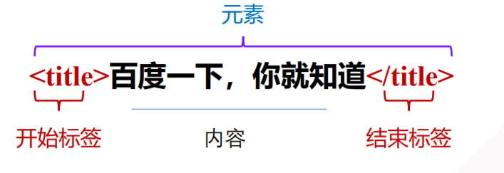
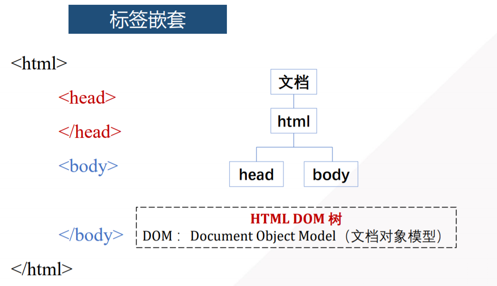
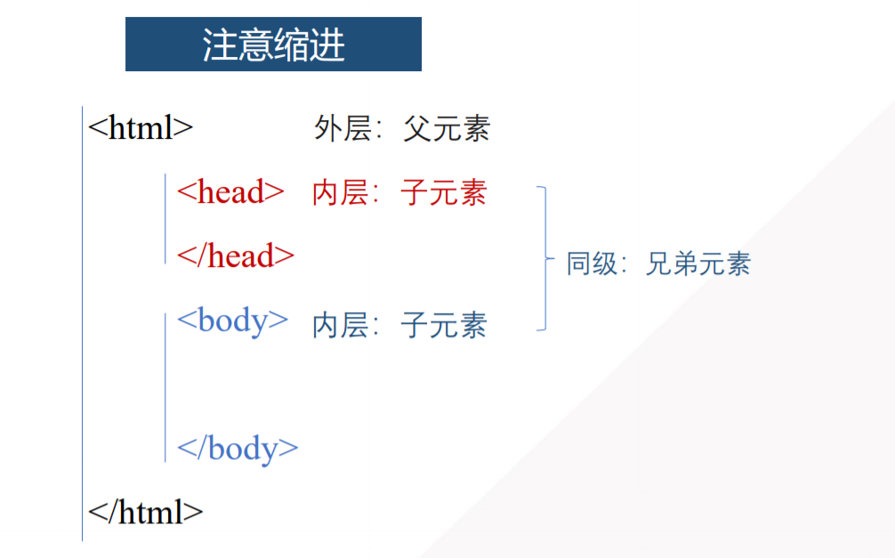
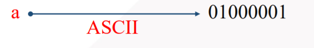

# 第一章：HTML5 基础

> HTML（HyperText MarkUp Language）
>
> **概述：**“超文本标记语言”，它是制作网页的标准语言


## 第一节：HTML5 入门

### 1.1.1 HTML5 语言特点

- HTML文件不需要编译，直接使用浏览器阅读即可
- HTML文件的扩展名是  .html  或  .htm
- HTML结构都是由标签组成
- HTML不区分大小写

### 1.1.2 HTML5 标签元素

> **概述：**由尖括号包围，比如 title，通常是成对出现








### 1.1.3 HTML5 编辑器

1. 记事本

2. 高级记事本

   - Sublime Text 3

     > emmet 插件

   - Notepad++

3. 编码器

   - Hbuilder
   - IDEA
   - Dreamweaver


### 1.1.4 字符与字符集

#### 字符(Character)

> **文字、符号**

```html
123 abc 一二三 ！，% @
```

#### 字符集(Charset)

> **字符的集合**

- 字符集 —— 语言文字
- 比如英文字符集、汉字字符集、日文汉字字符集


### 1.1.5 编 码

将字符和二进制码对应起来



#### 编码表

| 编码表  |            代表含义            |
| :-----: | :----------------------------: |
|  ASCII  | 数字、英文字母、符号进行了编码 |
| GB2312  |            简体中文            |
| Unicode |            所有语言            |
|  UTF-8  |     所有语言，占用空间更小     |

#### 乱码问题

- 源文件保存时的编码
- 源文件声明不一致，就会出现乱码问题


### 1.1.6 HTML5 文档基本格式

```html
<!-- 文档类型：符合HTML5标准 -->
< !DOCTYPE html>
<!-- lang属性：搜索引擎  en英文/zh中文 -->
<html lang="zh">
    <!-- 头部：浏览器、搜索引擎所需信息 -->
    <head>
        <!-- <meta>：元数据，charset属性：字符集编码方式   浏览器：UTF-8  是国际编码 -->
        <meta charset="UTF-8">
        <title>标题信息</title>
    </head>
    <!-- 主体：网页中包含的具体内容 -->
    <body>
        <!-- 此处为网页的内容部分 -->
    </body>
</html>
```


---


## 第二节：HTML5 标签

> **分类：**可以分为单标记和双标记
>
> - **单标记：**也称为空标记，指用一个标记符号即可完整地描述某个功能的标记
>
>   ```html
>   <hr />
>   ```
>
> - **双标记：**由开始和结束两个标记符组成的标记
>
>   ```html
>   <h2> </h2>
>   ```


### 1.2.1 HTML5 标签属性

> 一个标签可能有多个属性，属性先后顺序无关

```html
<标签名 属性1="属性值1" 属性2="属性值2" > </标签名>
```


### 1.2.2 HTML5 文档头部相关标记

- **设置页面标题标记 title**

  ```html
  <html> </html>
  ```

- **定义页面元信息标记 meta**

  > 可重复出现在 head 头部标记中，本身不包含任何内容，通过 “名称/值“ 的形式成对的使用其属性，可定义页面的相关参数

  ```html
  <meta />
  ```

  - **设置网页关键字** keywords

    > 使用name/content 属性可以为搜索引擎提供信息，其中 name 属性提供搜索内容名称，content 属性提供对应的搜索内容值

    ```html
    <meta name="keywords" content="培训，学习" />
    
    name 的属性值为 keywords，用于搜索内容名称为网页关键字
    content 属性的值用于定义关键字的具体内容，多个关键字内容之间可以用 ，分割
    ```

  - **设置网页描述** description

    ```html
    <meta name="description" content="培训，学习" />
    
    name 的属性值为 description，用于定义搜索内容名称为网页描述
    content 属性的值用于定义描述的具体内容
    ```

  - **设置网页作者** author

    ```html
    <meta name="author" content="培训，学习" />
    
    name 的属性值为 author，用于定义搜索内容名称为网页作者
    content 属性的值用于定义具体的作者信息
    ```

- **发送浏览器的头部信息**

  ```html
  <meta http-equiv="名称" content="值" />
  
  使用 http-equiv/content 属性可以设置服务器发送给浏览器的HTTP头部信息，为浏览器显示该页面提供相关参数
  http-equiv 属性提供参数类型，content 属性提供对应的参数值
  
  默认会发送
  <meta http-equiv="Content-Type" content="text/html" />
  通知浏览器发送的文件类型是HTML
  ```

  - **设置字符集**

    ```html
    <meta http-equiv="Content-Type" content="text/html； charset=utf-8" />
    
    其中 http-equiv 属性的值为Content-Type，content 属性的值为text/html 和 charset=utf-8，中间用 ；隔开，用于说明当前文档类型为HTML，字符集为utf-8
    ```

  - **设置页面自动刷新与跳转**

    ```html
    
    其中 http-equiv 属性的值为 refresh，content 属性的值为数值和 url地址，中间用 ；隔开，用于指定在特定的时间后跳转
    ```


### 1.2.3 HTML5 文本控制标记

1. **标题标记**

   > HTML提供了6个等级的标题，即：h1 h2 h3 h4 h5 h6，从 h1 到 h6 重要性递减

   ```html
   <h1 align="对齐方式"> 标题文本 </h1>
   
   align：有三种对齐方式，left  center  right
   
   <!-- 一个页面中只能使用一个 <h1> 标记，常常被用在网站的 LOGO 部分-->
   ```

2. **段落标记**

   > 文本在段落中会根据浏览器窗口的大小自动和换行

   ```html
   <p style="align: left;"> 段落文本 </p>
   ```

3. **水平线标记**

   > 使用水平线将段落与段落之间隔开，使得文档结构清晰，层次分明
   >
   > 可以通过插入图片实现，也可以简单地通过标记来完成

   ```html
   <hr 属性="属性值" />
   
   <!-- 实际开发中，不建议使用 <hr /> 的所有外观属性，可通过CSS样式来进行设置 -->
   ```

   | 属性名 |         含义         |                           属性值                           |
   | :----: | :------------------: | :--------------------------------------------------------: |
   | align  | 设置水平线的对齐方式 |      可选择 left、center、right 三种值，默认为 center      |
   |  size  |   设置水平线的粗细   |                  以像素为单位，默认为2px                   |
   | color  |   设置水平线的颜色   |                 可用颜色名称、十六进制RGB                  |
   | width  |   设置水平线的宽度   | 可以是确定的像素值，也可以是浏览器窗口的百分比，默认为100% |

4. **换行标记**

   > 一个段落中，如果希望某段文本强制换行显示，就需要使用换行标记

   ```html
   <br />
   ```

5. **文本格式化标记**

   |     常用的文本格式化标记     |                        显示效果                         |
   | :--------------------------: | :-----------------------------------------------------: |
   | <b></b> 和 <strong></strong> | 文本以粗体方式显示（b定义文本粗体，strong定义强调文本） |
   |     <i></i> 和 <em></em>     |   文本以斜体方式显示（i定义文本粗体，em定义强调文本）   |
   |    <s></s> 和 <del></del>    |        文本以删除线方式显示（HTML5 不建议使用s）        |
   |    <u></u> 和 <ins></ins>    |        文本以下划线方式显示（HTML5 不建议使用u）        |

6. **特殊字符标记**

   | 特殊字符(代码形式) |     描述      | 字符的代码(后面加 ; ) |
   | :----------------: | :-----------: | :-------------------: |
   |     **&nbsp;**     |   **空格**    |       **&nbsp**       |
   |        &lt;        |    小于号     |          &lt          |
   |        &gt;        |    大于号     |          &gt          |
   |       &amp;        |    和、与     |         &amp          |
   |       &yen;        |    人民币     |         &yen          |
   |     **&copy;**     |   **版权**    |       **&copy**       |
   |       &reg;        |   注册商标    |         &reg          |
   |       &deg;        |    摄氏度     |         &deg          |
   |      &plusmn;      |    正负号     |        &plusmn        |
   |      &times;       |     乘号      |        &times         |
   |      &divide;      |     除号      |        &divide        |
   |       &sup2;       | 平方2 (上标2) |         &sup2         |
   |       &sup3;       | 立方3 (上标3) |         &sup3         |


### 1.2.4 图像标记

> 常用的图像格式：GIF、PNG、JPG

```html


<!-- src 是img 标记的必须属性 -->
```

|  属性  | 属性值 |                          描述                          |
| :----: | :----: | :----------------------------------------------------: |
|  src   |  URL   |                       图像的路径                       |
|  wdth  |  像素  |                       图像的宽度                       |
| height |  像素  |                       图像的高度                       |
| border |  数字  |                   设置图像边框的宽度                   |
| title  |  文本  |                  图像悬停时显示的内容                  |
|  alt   |  文本  |                图像不能显示时的替换文本                |
| vspace |  像素  |          设置图像顶部和底部的空白（垂直边距）          |
| hspace |  像素  |          设置图像左侧和右侧的空白（水平边距）          |
|        |        |                                                        |
| align  |  left  |                    将图像对齐到左边                    |
| align  | right  |                    将图像对齐到右边                    |
| align  |  top   | 将图像的顶端和文本的第一行文字对齐，其他文字居图像下方 |
| align  | middle | 将图像的水平中线和文本的第一行对齐，其他文字居图像下方 |
| align  | bottom |   将图像的底部和文本的第一行对齐，其他文字居图像下方   |

> **图像的属性格式**
>
> ```html
> 
> ```
>
> > **边距属性：** vspace、hspace
> >
> > 页面中，由于排版需要，有时候还需要调整图像的边距，HTML中通过 vspace 和 space 属性可以分别调整图像的垂直边距和水平边距

#### 绝对路径和相对路径

- **绝对路径：**是网页上的文件或目录在硬盘上的真正路径 D:\office\logo.jpg ，或完整的网络地址 http://www.baidu.com

- **相对路径：**相对于当前文件的路径，相对路径不带有盘符，通常以 HTML 网页文件为起点，通过层级关系描述目标图像的位置

  > **总结起来为以下3点**	

  - **图像文件和 HTML文件 位于同一个文件夹：**只需要输入图像文件的文件名称即可

    ```html
    
    ```

  - **图像文件位于 HTML文件 的下一级文件夹：**输入文件夹名和文件名，之间用 "/" 隔开

    ```html
    
    ```

  - **图像文件位于 HTML文件  的上一级文件夹：**在文件名之前加入 "../" ，如果是上两级，则需要使用 "../../" 以此类推

    ```html
    
    ```


### 1.2.5 超链接标记

#### 语法格式

```html
<a href="跳转目标" target="目标窗口的弹出方式"> 文本或图像 </a>

href：用于指定链接目标的url地址，当a标记应用href属性时，它就具有了超链接的功能
target：用于指定链接页面的打开方式，取值为 _self 和 _blank
	_self 为默认值，意为在原窗口打开
	_blank 在新窗口打开
```

#### 锚点链接

> 使用 a 标签创建链接文本，其中 href=#id名 用于指定链接目标的 id名称，然后使用相应的 id名称标注跳转目标的位置

```html
<body>
    <ul>
        <li> 目录 </li>
        <li><a href="#one"> 第一章 </a></li>
        <li><a href="#two"> 第二章 </a></li>
        <li><a href="#three"> 第三章 </a></li>
    </ul>
    
    <h3 id="one"> 第一章 </h3>
    <h3 id="two"> 第二章 </h3>
    <h3 id="three"> 第三章 </h3>
</body>
```

*技巧：*

*暂时没有确定链接目标时，通常将 a 标记的 href 属性值定义为 #，表示该链接暂时为一个空链接*

*链接图像在低版本的IE浏览器中会添加边框效果，去掉链接图像的边框只需要将边框定义为0即可*


---


## 第三节：HTML5 页面元素及属性

### 1.3.1 列表元素

1. **ul 元素**

   > 无序列表的各个列表项之间没有顺序级别之分，通常是并列的

   ```html
   <ul>
       <li>第一行</li>
       <li>第二行</li>
       <li>第三行</li>
   </ul>
   
   <!-- 效果展示 -->
   · 第一行
   · 第二行
   · 第三行
   ```

2. **ol 元素**

   > 有序列表的各个列表项按照一定的顺序排列

   ```html
   <ol>
       <li start="2">第二章</li>
       <li>第三章</li>
   </ol>
   
   <!-- 效果展示 -->
   2.第二章
   3.第三章
   
   <!-- 属性值 -->
   start：更改列表编号的起始值
   reversed：表示是否对列表进行反向排序，默认值为 ture
   ```

3. **dl 元素**

   > 自定义列表，用于对术语或名词进行解释描述，定义的列表没有任何项目符号

   ```html
   <dl>
       <dt> 名词 </dt>
       	<dd> 名词解释1 </dd>
       	<dd> 名词解释2 </dd>
   </dl>
   
   dt：指定术语名词
   dd：对名词进行解释描述，可以使用多个dd，对名词进行多项解释
   ```

4. **列表的嵌套应用**

   ```html
   <ul>
       <li> 咖啡
       	<ol>
               <li> 拿铁 </li>		<!-- 有序列表的嵌套 -->
               <li> 摩卡 </li>
           </ol>
       </li>
       
       <li> 茶叶
       	<ul>
               <li> 龙井 </li>		<!-- 无序列表的嵌套 -->
               <li> 碧螺春 </li>
           </ul>
       </li>
   </ul>
   
   <!-- 效果展示 -->
   · 咖啡
   	1.拿铁
   	2.摩卡
   · 茶叶
   	· 龙井
   	· 碧螺春
   ```

### 1.3.2 结构元素

1. **header 元素**

   > 具有引导和导航作用的结构元素，该元素可以包含所有通常放在页面头部的内容。
   >
   > 通常用来放置整个页面或页面内的一个内容区块的标题，也可以包含logo，搜索表单 等

   ```html
   <header>
   	<h1> 网页主题 </h1>
       <h3> 副标题 </h3>
   </header>
   ```

   `一个页面中，并不限制header元素的个数，可以使用多个 header元素，也可以为每一个内容块添加 header元素`

2. **nav 元素**

   > HTML5 新增元素，用于定义导航链接，该元素可以将具有导航性质的链接归纳在一个区块中，使页面元素的语义更加明确

   ```html
   <nav>
       <ul>
           <li> 导航1 </li>
           <li> 导航2 </li>
       </ul>
   </nav>
   ```

   `通常在 nav元素 内部嵌套无序列表ul 来搭建导航结构，一个页面中可以包含多个 nav元素 来作为页面整体或不同层级的导航`

   - **传统导航条：**目前主流网站上都有不同层级的导航条，其作用是跳转到网站的其他主页面

   - **侧边栏导航：**目前主流博客网站及电商网站都有侧边栏导航，目的是将当前文章或当前商品页面跳转到其他文章或其他商品页面

   - **页内导航：**它的作用是在本页面几个主要的组成部分之间进行跳转

   - **翻页导航：**翻页操作切换的是网页的内容部分，可以通过单击"上一页"或"下一页"切换，也可以通过单击实际的页数跳转到某一页

     `nav元素也可以用于其他重要的、基本的导航链接组中，但并不是所有的导航链接组都要被放进 nav元素，只需要将主要和基本的链接放进 nav元素即可`

3. **article 元素**

   > article元素 代表文档、页面或者应用程序中与上下文不相关的独立部分，该元素经常被用于定义一篇日志、一条新闻或用户评论等。一个页面中 article元素 可以出现多次
   >
   > article元素 通常使用多个 section元素 进行划分

   ```html
   <body>
       <article>
       	<header>
           	<h3> 第一章 </h3>
           </header>
           
           <section>
               <header>
           		<h4> 第一节 </h4>
           	</header>
           </section>
           
           <section>
               <header>
           		<h4> 第二节 </h4>
           	</header>
           </section>
           
       </acticle>
   </body>
   ```

4. **aside 元素**

   > 用来定义当前页面或文章的附属信息部分，它可以包含与当前页面或主要内容相关的引用、侧边栏、广告<、导航条等其他类似的有别于主要内容的部分

   **两种用法：**

   - 被包含在 article元素 内，作为主要内容的附属信息

   - 在 article元素 之外使用，作为页面或站点全局的附属信息部分。最常用的使用形式是侧边栏，其中的内容可以是友情链接、广告单元等

     ```html
     <body>
         <article>
         	<header>
             	<h3> 第一章 </h3>
             </header>
             
             <section> 主要内容 </section>
             <aside> 其他相关文章 </aside>
         </article>
         
         <adide> 右侧菜单 </adide>
     </body>
     ```

5. **section 元素**

   > 用于对于网站或应用程序中页面上的内容进行分块，一个 section元素 通常由内容和标题组成

   **注意：**

   1. 不要将 section元素 用作设置样式的页面容器，那是 div 的特性，section元素 并非一个普通的容器元素，当一个容器需要被直接定义样式或通过脚本定义行为时，推荐使用 div
   2. 如果 article元素、aside元素 或 nav元素 更符合使用条件，那么不要使用 section元素
   3. 没有标题的内容区块不要使用 section元素 定义

   ```html
   <body>
       <article>
           <header>
               <h3> 才艺展示 </h3>
           </header>
           <p> 内容介绍 </p>
           
       	<section>
               <h3> 选手 </h3>
               
               <article>
   				<3> 一号选手：张三 </3>
                   <p> 唱歌 </p>
               </article>
               
               <article>
   				<3> 二号选手：李四 </3>
                   <p> 跳舞 </p>
               </article>
               
           </section>
       </article>
   </body>
   
   <!-- 解释：
   	header元素 用来定义才艺展示的标题，section元素 用来存放选手
   	article元素 用来划分 section元素 所定义的内容，将其分为两部分 -->
   ```

   > article元素 可以看作是一种特殊的 section元素，它比 section元素 更具有独立性
   >
   > ​	即：`section元素 强调分段或分块，article元素 强调独立性`
   >
   > - **如果一块内容相对来说比较独立、完整时，应该使用 article元素**
   >
   > - **如果想要将一块内容分成多段时，应该使用 section元素**

6. **footer 元素**

   > 用于定义一个页面或区域的底部，它可以包含所有通常放在页面底部的内容，一个页面中可以出现多个 footer元素，也可以在 artilcle元素 或者 section元素 中添加 footer元素

   ```html
   <article>
       文章内容
       ...
   	<footer>
           文章内容底部
           ...
       </footer>
   </article>
   <footer>
       文章底部
       ...
   </footer>
   ```


### 1.3.3 分组元素

> 用于对页面内容进行分组，HTML5 中涉及 3个分组有关的元素，分别是：figure元素、figcaption元素、hgroup元素

1. **figure 元素 和 figcaption元素**

   > 1. **figure 元素**
   >    - figure元素 用于定义独立的流内容（图像、图表、照片、代码等），一般指一个单独的单元。
   >    - figure元素 的内容应该与主内容相关，但如果被删除，也不会对文档流产生影响
   > 2. **figcaption 元素**
   >    - figcaption元素 用于为 figure元素组添加标题
   >    - 一个 figure元素 内最多允许使用一个 figcaption元素，该元素应该放在 figure元素 的第一个或者最后一个子元素的位置

   ```html
   <body>
       <figure>
       	<figcaption> 标题 </figcaption>
           <p> 内容... </p>
       </figure>
       
       <figure>
           <p> 内容... </p>
           <figcaption> 标题 </figcaption>
       </figure>
   </body>
   ```

2. **hgroup 元素**

   > 用于将多个标题组成一个标题组，通常它与 h1~h6元素 组合使用，通常将 hgroup元素 放在 header元素 中

   **注意：**

   1. 如果只有一个标题元素，不建议使用 hgroup元素
   2. 当一个标题包含副标题、section 或者 article元素 时，建议将 hgroup元素 和标题相关元素存放到 header元素 容器中

   ```html
   <body>
       <header>
       	<hgroup>
           	<figcaption> 标题1 </figcaption>
               <p> 内容... </p>
               
               <figcaption> 标题2 </figcaption>
               <p> 内容... </p>
           </hgroup>
       </header>
   </body>
   
   
   <body>
       <hgroup>
           <figcaption> 标题1 </figcaption>
           <p> 内容... </p>
   
           <figcaption> 标题2 </figcaption>
           <p> 内容... </p>
       </hgroup>    
   </body>
   ```


### 1.3.4 页面交互元素

1. **details 元素 和 summary 元素**

   > 用于描述文档或文档某个部分的细节
   >
   > summary 元素 经常与 details 元素配合使用，作为 details 元素 的第一个子元素，用于为 details 元素 定义标题，标题是可见的，当用户单击标题时，会显示或隐藏 details 中的其他内容

   ```html
   <body>
       <detalis>
       	<summary> 显示列表 </summary>
           <ul>
               <li> 列表1 </li>
               <li> 列表2 </li>
           </ul>
       </detalis>
   </body>
   
   <!-- 效果展示 
   		折叠列表，类似于折叠菜单效果 -->
   > 显示列表
   	· 列表1
   	· 列表2
   ```

2. **progress 元素**

   > 用于表示一个任务的完成进度，这个进度可以是不确定的，只是表示进度正在进行，但是不清楚还有多少工作量没有完成，也可以用 0 到某个最大数字（100）之间的数字来表示准确的进度完成情况（如 进度百分比）

   **progress 元素 的常用属性值：**

   - value：已经完成的工作量

   - max：总共有多少工作量

     **注意：**value 和 max 属性的值必须大于 0，且 value 的值要小于 max 属性的值

   ```html
   <body>
       <h3> 加载进度条 </h3>
       <p> <progress value="50" max="100" ></progress> </p>
   </body>
   ```

3. **meter 元素**

   > 用于表示指定范围内的数值，例如：显示硬盘容量或者对某个候选者的投票人数占投票总人数的比例等，都可以使用 meter 元素

   | 常用属性 |                             说明                             |
   | :------: | :----------------------------------------------------------: |
   |   high   |             定义度量的值位于哪个点被界定为高的值             |
   |   low    |             定义度量的值位于哪个点被界定为低的值             |
   |   max    |                    定义最大值，默认值是 1                    |
   |   min    |                    定义最小值，默认值是 0                    |
   | optimum  | 定义什么样的度量值是最佳的值。<br />如果该值高于 high 属性，则意味着值越高越；<br />如果该值低于 high 属性，则意味着值越低越好 |
   |  value   |                         定义度量的值                         |

   ```html
   <body>
       <h1> 成绩列表 </h1>
       <p>小红：<meter value="65" min="0" max="100" low="60" high="80" title="65分" optimum="100" > 65 </meter> </p>
       
           		    分数为80分  最低0分  最高100分  及格60分  优秀80分    显示80分
       <p>小明：<meter value="80" min="0" max="100" low="60" high="80" title="80分" optimum="100" > 80 </meter> </p>
    最佳值为100分
       
   </body>
   ```


### 1.3.5 文本层次语义元素

> 为了使 HTML5 页面中的文本内容更加生动形象，需要使用一些特殊的元素来突出文本之间的层次关系，这样的元素被称为层次语义元素。主要包括 time 元素、mark 元素、cite 元素

1. **time 元素**

   > 用于定义时间或日期，可以代表24小时中的某一时间，time元素 不会在浏览器中呈现任何特殊效果，但是该元素能以机器可读的方式对日期和时间进行编码，这样能够将生日提醒或其他时间添加到日程表中，搜索引擎也能够生成更智能的搜索结果

   time 元素 的属性：

   - datetime：用于定义相应的时间或日期，取值为具体时间（14:00）或具体日期（2020-07-31），不定义该属性时，由元素的内容给定日期/时间
   - pubdate：用于定义 time 元素中的日期/时间是文档（或 article 元素）的发布时间，取值一般为 "pubdate"

   ```html
   <body>
       <p> 这是一条新消息 </p>
       <p>
           <time datetime="2020-07-31" pubdate="pubdate" >
               本消息发布于2020年7月31日
           </time>
       </p>
   </body>
   ```

2. **mark 元素**

   > 主要功能是在文本中高亮显示某些字符，引起用户注意。
   >
   > 该元素的用法与 em 和strong 有相似之处，但是 mark元素 在突出显示样式时更随意灵活（`mark效果`）

   ```html
   <body>
       <p> 这是一句话，虽然 <mark> 并没有什么意义 </mark> </p>
   </body>
   ```

3. **cite 元素**

   > 可以创建一个引用标记，用于对文档参考文献的引用说明，一旦在文档中使用了该标记，被标记的文档内容将以斜体的样式展示在页面中，以区别于段落中的其他字符

   ```html
   <body>
       <p> 正文内容，正常显示 </p>
       <cite> 引用标记，斜体显示 </cite>
   </body>
   ```


### 1.3.6 全局属性

> 全局属性是指在任何元素中都可以使用的属性。常用的有draggable、hidden、spellcheck、contenteditable

1. **draggable 属性**

   > 用来定义元素是否可以拖动，该属性有两个值：true 和 false，默认为：false
   >
   > 当值为 true 时，表示元素选中之后可以进行拖动操作，否则不能动

   ```html
   <body>
       <article draggable="true"> 可以拖动的文字 </article>
       不可拖动的图片
   </body>
   ```

   <!-- 注意：该属性在网页中所实现的效果并不能拖动，必须要结合 Javascript 使用才行 -->

2. **hidden 属性**

   > 在 HTML5 中，大多数元素都支持hidden 属性，该属性有两个值：true 和 false，默认为：false
   >
   > **当值为 true 时，元素将会被隐藏，反之则显示**
   >
   > 元素中的内容是通过浏览器创建的，页面装载后允许使用 Javascript 脚本将该属性取消，取消后该元素变为可见状态

   ```html
   hidden: true;
   ```

3. **spellcheck 属性**

   > 主要针对于Input 元素 和 textarea 文本输入框，对用户输入的文本内容进行拼写和语法检查
   >
   > spellcheck 属性 有两个值：true 和 false，默认为：false
   >
   > **值为 true 时，检测输入框中的值，反之不检测**

   ```html
   <body>
       <p> 输入框检测值为 true </p>
       <textarea spellcheck="true"> HTML5 </textarea>
       
       <p> 输入框检测值为 false </p>
       <textarea spellcheck="false"> CSS </textarea>
   </body>
   ```

4. **contenteditable 属性**

   > 规定是否可编辑元素的内容，但是前提是该元素必须可以获得鼠标焦点并且其内容不是只读的
   >
   > 该属性有两个值：true 可编辑，false 不可编辑

   ```html
   <body>
       <ul contenteditable="true">
           <li> 列表1 </li>
           <li> 列表2 </li>
           <li> 列表3 </li>
       </ul>
   </body>
   ```

