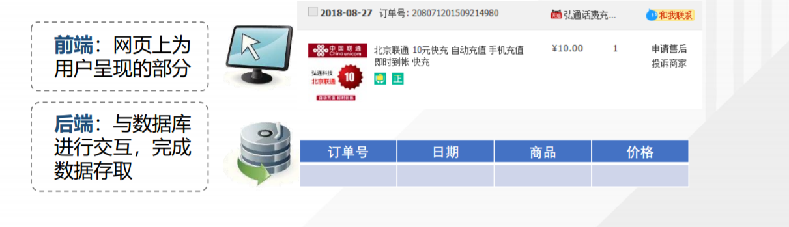
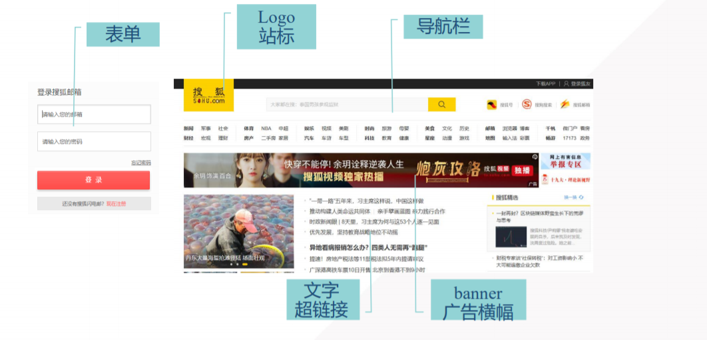
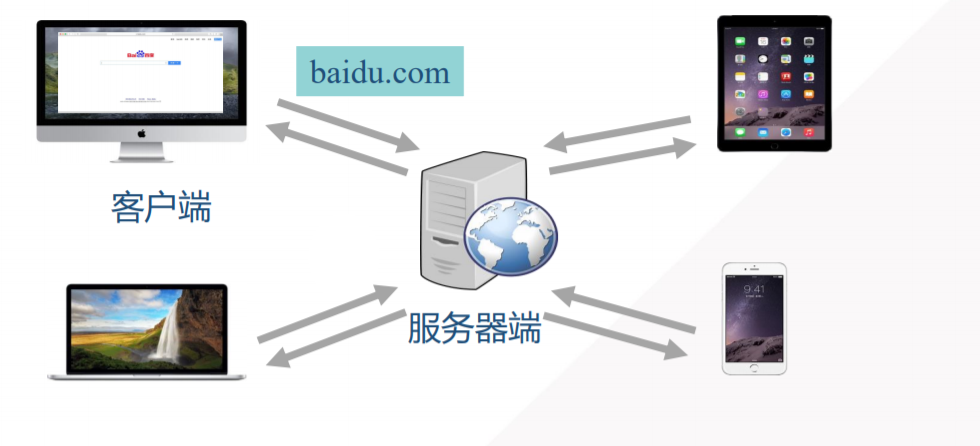
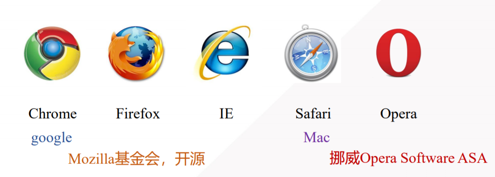
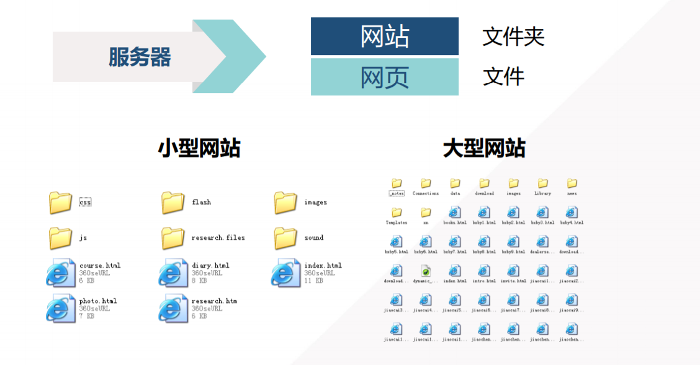
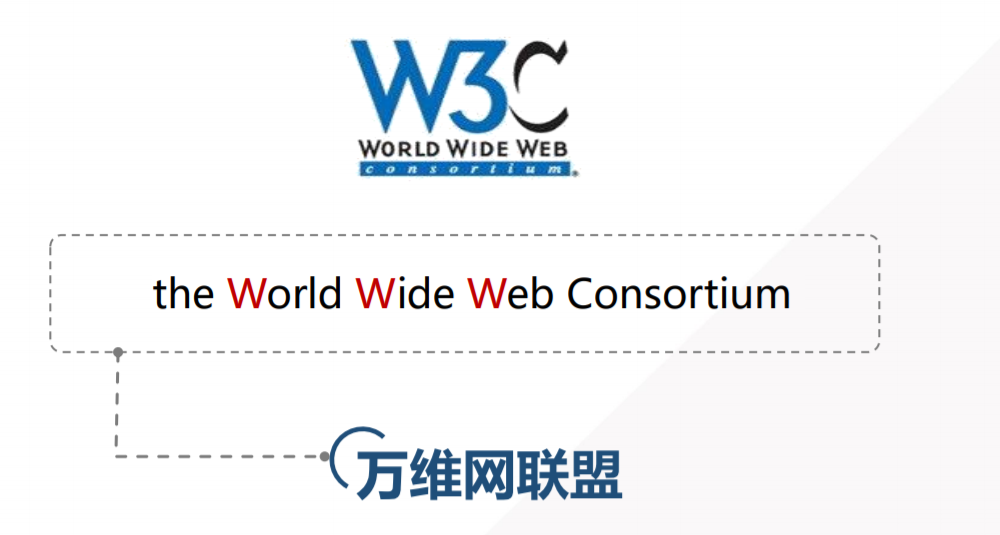
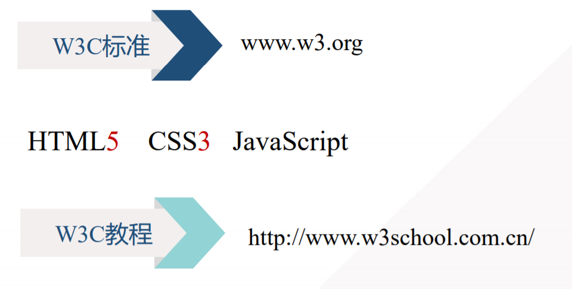

# 		全栈应用开发引言

> 全栈应用开发分为 **前端开发** 和 **后端开发** 两部分

  

---

# 第一部分：WEB前端开发

## 简介、开发前景

> WEB：web系统
>
> - 以网站形式呈现，通过浏览器访问，完成一定功能的系统
>
> 前端：网页上为用户呈现的部分
>
> 开发：编写代码

|   开发前景   | 工作内容 |
| :----------: | :------: |
|  网站架构师  |          |
|   网页美工   |          |
| 前端开发人员 |          |

---

## 网站与网页

### 网站 (web site)

> **概述：**互联网上用于展示特定内容的相关网页的集合

### 网页 (web page)

> **概述：**网站中的一页，一个网站中的网页通过“超链接”的方式被组织在一起

**分类：**网页根据内容是否改变分为

- **静态页面：**编写之后在浏览器不再改变的网页。HTML就是用于编写静态网页的
- **动态页面：**会根据不同的情况展示不同的内容。例如：登录成功后右上角显示用户名

#### 主页 homepage

> **概述：**进入网站看到的第一个网页，主页的文件名通常是index

#### 页面元素

----

## 服务器与浏览器

### 服务器

> **概述：**可以处理客户端的请求并返回相应响应。目前最主流的三个Web服务器是Apache、 Nginx 、IIS

### 浏览器

> **概述：**解析网页源代码，渲染网页

- 查看浏览器市场份额：https://tongji.baidu.com/research/site 

#### 分类

- shell部分

- 内核部分

  - 渲染引擎（语法规则和渲染）

  - js引擎

    > 2001年发布ie6，首次实现对js引擎的优化和分离

- 其他模块

#### 常用浏览器以及浏览器内核

1. IE浏览器内核：Trident内核，也是俗称的IE内核

2. **Chrome浏览器内核：统称为Chromium内核或Chrome内核，以前是Webkit内核，现在是Blink内核**

   > 2008年 Chrome 谷歌和苹果联合开发浏览器
   >
   > 它采用优化后的JavaScript引擎，引擎代号为V8
   >
   > 因能把js代码直接转化为机械码来执行，进而以速度快而闻名
   >
   > 2008年9月1日Google在其官方博客上宣布退出Chrome浏览器
   >
   > 之后Firefox也推出了具备强大功能的js引擎

3. Firefox浏览器内核：Gecko内核，俗称Firefox内核

4. Safari浏览器内核：Webkit内核

5. Opera浏览器内核：最初是自己的Presto内核，后来是Webkit，现在是Blink内核

6. 360浏览器、猎豹浏览器内核：IE+Chrome双内核

7. 搜狗、遨游、QQ浏览器内核：Trident（兼容模式）+Webkit（高速模式）

8. 百度浏览器、世界之窗内核：IE内核

9. 2345浏览器内核：以前是IE内核，现在也是IE+Chrome双内核

### 服务器与网页关系

---

## 前端技术标准、构成

### W3C标准

W3C：万维网联盟（the World Wide Web Consortium）

### 前端技术构成

结构：HTML

> 从语义的角度，描述页面结构
>
> **简单理解：用于展示需要显示的数据**

样式：CSS

> 从审美的角度，美化页面
>
> **简单理解：使显示的数据更佳好看**

行为：JavaScript

> 脚本语言，用于构建网页行为，与用户进行交互，使用户获得更好的体验
>
> **简单理解：使整个页面显示的数据具有动画效果**

|  基础语言  | 作用 |            说明            |
| :--------: | :--: | :------------------------: |
|    HTML    | 结构 | 从语义的角度，描述页面结构 |
|    CSS     | 样式 |   从审美的角度，美化页面   |
| JavaScript | 行为 | 从交互的角度，提升用户体验 |

